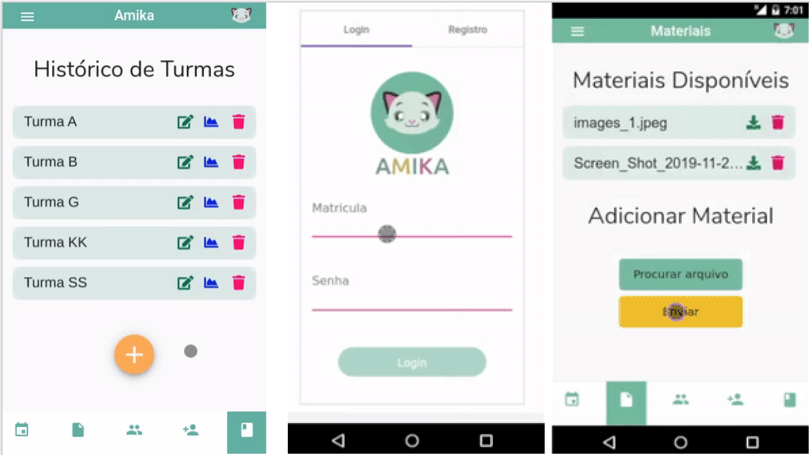
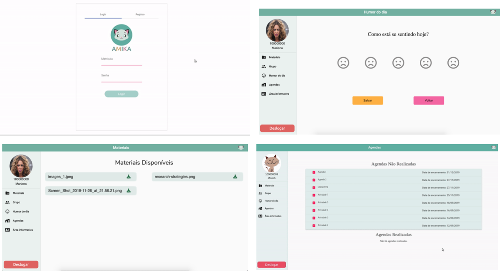

<p align="center">
    <a src="https://fga-eps-mds.github.io/2019.2-Amika-Wiki/">
        
    </a>
</p>

#### [Amika-Backend](https://github.com/fga-eps-mds/2019.2-Amika-Backend)
[](https://travis-ci.org/fga-eps-mds/2019.2-Amika-Backend)
[](https://codeclimate.com/github/fga-eps-mds/2019.2-Amika-Backend/maintainability)
[](https://coveralls.io/github/fga-eps-mds/2019.2-Amika-Backend?branch=develop)

#### Ambientes:
- [Desenvolvimento](https://amika-backend-dev.herokuapp.com/)
- [Homologação](https://amika-backend-stg.herokuapp.com/)
- [Produção](https://amika-backend.herokuapp.com/)

#### [Amika-Frontend](https://github.com/fga-eps-mds/2019.2-Amika-Frontend)
[](https://travis-ci.org/fga-eps-mds/2019.2-Amika-Frontend)
[](https://codeclimate.com/github/fga-eps-mds/2019.2-Amika-Frontend/maintainability)
[](https://coveralls.io/github/fga-eps-mds/2019.2-Amika-Frontend?branch=develop)

#### Ambientes:
- [Desenvolvimento](https://amika-dev.herokuapp.com/)
- [Homologação](https://amika-stg.herokuapp.com/)
- [Produção](https://amika-prod.herokuapp.com/)

## Sobre

Amika é um Progressive Web App com o objetivo de auxiliar a organização da disciplina de Tópicos Especiais em Engenharia de Software, com abordagem em Felicidade, da Universidade de Brasília. Assim como também proporcionar para os alunos um ambiente de interação e ajuda para lidar com problemas de saúde mental, fornecendo uma experiência mais agradável.

### Aplicação
#### Professor

<p align="center">
    <a src="https://fga-eps-mds.github.io/2019.2-Amika-Wiki/">
        
    </a>
</p> <br>

#### Aluno
<p align="center">
    <a src="https://fga-eps-mds.github.io/2019.2-Amika-Wiki/">
        
    </a>
</p> <br>


## Tecnologias Utilizadas

O projeto foi dividido em dois repositórios: o [Amika-Backend](https://github.com/fga-eps-mds/2019.2-Amika-Backend) que é desenvolvido com o framework [Django](https://www.djangoproject.com) escrito em [Python](https://www.python.org) e o [Amika-Frontend](https://github.com/fga-eps-mds/2019.2-Amika-Frontend) que é desenvolvido com o framework [Angular](https://angular.io) escrito em [TypeScript](https://www.typescriptlang.org). Os dois se comunicão através de requisições HTTP auxiliado pelo [Django REST framework](https://www.django-rest-framework.org). O ambiente de desenvolvimento é isolado em containers com o [Docker](https://www.docker.com) e o gerenciamento é feito pelo [Docker Compose](https://docs.docker.com/compose/). A integração contínua é feita pelo [Travis CI](https://docs.travis-ci.com). Os deployments de desenvolvimentos, homologações e produções são feitos no [Heroku](https://devcenter.heroku.com).

## Ambiente de Desenvolvimento

Para subir o GitHub Pages localmente, existem duas opções: 
- Node.js/Docsify  
    - Baixe e instale o [Node.js](https://nodejs.org/en/);
    - Instale o [Docsify](https://docsify.js.org) com o comando ```npm i docsify-cli -g```;
    - Rode-o com o comando ```docsify serve``` no diretório raiz do projeto;
    - Abra o navegador e vá para a url [http://localhost:3000](http://localhost:3000).
    
- Python
    - Baixe e instale o [Python3](https://www.python.org/downloads/);
    - Rode-o com o comando ```python -m SimpleHTTPServer [PORT]*``` no diretório raiz do projeto.
    - Abra o navegador e vá para a url [http://localhost:3000](http://localhost:3000) ou [http://localhost:[PORT]*](http://localhost)
    
    *```[PORT]``` deve ser excuído ou substituído por valor numérico.

## Documentação

Documentação do porjeto está disponível em [Amika Wiki](https://fga-eps-mds.github.io/2019.2-Amika-Wiki/#/).

## Licença

Este projeto está licenciado sob os termos da [licença MIT](https://github.com/fga-eps-mds/2019.2-Amika-Wiki/blob/master/LICENSE).

Copyright (c) 2019 Amika
