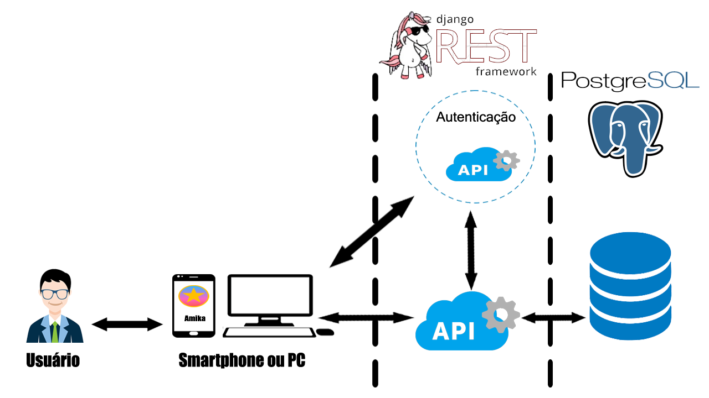

## 1. Introdução
#### 1.1. Objetivo

Este documento tem como finalidade fornecer uma visão geral da arquitetura do projeto Amika, contem informações pertinentes sobre qual o modelo de arquitetura adotado, diagramas que ilustram casos de uso, diagramas de classes, entre outros recursos .

#### 1.2. Escopo

Através desse documento, é possível obter um melhor entendimento da arquitetura do Gaia, permitindo ao leitor compreender o funcionamento de seu sistema, como também a abordagem utilizada para o seu desenvolvimento.

#### 1.3. Definições, Acrônimos e Abreviações

**Acrônimo/Abreviação** | **Definição**
------------------------|-------------------
UnB | Universidade de Brasília.

#### 1.4. Referências Bibliográficas

#### 1.5. Visão Geral

**Tópico** | **Definição**
---------------|-----------------------------
Introdução | Descreve informações sobre a finalidade deste documento.
Representação Arquitetural | Descreve qual é a arquitetura de software, para melhor compreensão de sua estrutura e funcionamento e mostra como ela está sendo representada.
Metas e Restrições | Descreve os requisitos e objetivos do software, e se estes  têm algum impacto sobre a arquitetura.
Visão lógica | Descreve as partes significativas do ponto de vista da arquitetura do modelo de design.

## 2. Representação Arquitetural

A arquitetura do Amika é composta por frontend e backend desacoplados, cada um possuindo seu próprio repositório. Por consequência desse desacoplamento, o risco de uma mudança em um dos dois não causará efeitos colaterais na implementação do outro. Podemos classificar a arquitetura como híbrida já que utiliza fundamentos de dois padrões arquiteturais, sendo eles: Cliente-Servidor e MVC. 

#### Cliente Servidor
É um modelo arquitetural em que a informação é dividida em plataformas independentes, cliente e servidor. Geralmente, o cliente faz requisições por meio de um protocolo específico e um servidor responde de acordo com o que foi passado para ele. No Amika o cliente é representado pela interface PWA que irá realizar requisições HTTP por meio do REST para o servidor, sendo nesse caso o Django. 

#### PWA (Progressive Web App)
Os PWA são páginas web tecnicamente regulares que podem aparecer ao usuário como aplicativos tradicionais ou aplicativos móveis. Em resumo, os PWA ter uma experiência de uso muito próxima da de mobile apps. As principais funcionalidades oferecidas por essas tecnologias são:
- Push Notification
- Ícone na tela home do smartphone
- Splash screen
- Processos rodando em background
- Suporte a funcionamento em modo Offline
- Acesso à camera e galeria
- Acesso à geolocalização
- Acesso à os contatos
- Django
- O Django é um framework com arquitetura baseada no MVC (Model-View-Controller), apesar disso, é descrita como MVT (Model-View-Template).

#### Django REST Framework
O REST é uma extensão do Django Framework que permite implementar API's REST de forma rápida. A arquitetura REST opera por métodos de protocolo HTTP.

#### Model View Template (MVT)
É uma arquitetura que separa as aplicações construídas com ela em três camadas. Essas camadas estão interconectadas e são: Model, View e Template.
- Model: é o modelo da aplicação, responsável por receber dados e interpretá-los para serem mostrados no Template. Ou seja, responsável pela escrita e leitura de dados.
- View: no django tem o mesmo papel exercido pela controller em outros padrões de arquitetura, como o Rails, por exemplo. Recebe requisições e as trata, define qual template será mostrado ao usuário e qual model usar.
- Template: é apenas a camada de interação com o usuário, simplesmente mostra os dados ao usuário.

#### PostgreSQL
É um banco de dados relacional. Relacional é a abordagem adotada nesse banco de dados e abordagem significa como os dados estão organizados. Na abordagem relacional os dados são dispostos em tabelas (linhas e colunas) e suas relações (chaves estrangeiras).

#### Angular
É um framework para criação de interfaces de aplicações. Para tal, utiliza  HTML, CSS e TypeScript. Por meio dele é possível desenvolver não somente para web, mas também para mobile. No Amika é utilizado para implementar todo o frontend respeitando a metodologia PWA.

#### Diagrama de relações
<figure>
    

        
        <figcaption>Diagrama de relações versão 1.0</figcaption>
    

</figure>

## 3. Objetivo e Restrições da arquitetura

#### 3.1. Requisitos para o Amika:
- Funcionar em web.
- Uso do PWA, para funcionar em smartphones.

#### 3.2. Tecnologias utilizadas no Amika:
- Django: Web Framework baseada em Python.
- Django Rest Framework: caixa de ferramentas e APIs para o Django.
- Python: Linguagem utilizada no Django.
- PWA: Software utilizado para implementação do uso em smartphones.
- Angular: Web Framework utilizado no frontend.
- Java Script: Linguagem utilizado junto com o HTML e CSS, para desenvolvimento WEB.
- HTML: Linguagem base utilizado em desenvolvimento WEB.
- CSS: Linguagem usada juntamente com HTML para estilizar a pagina.

## 4. Visão Lógica

#### 4.1. Visão Geral
O Amika é uma aplicação PWA composta da linguagem Python e do web framework django, usando HTML, CSS e o Angular no front-end. O objetivo do Amika é ser uma aplicação que facilite a comunicação e contato entre professor, alunos e monitores da disciplina de Felicidade ofertada na Universidade de Brasília no campus do Gama. A partir do Banco de dados PostgreSQL será possível armazenar dados dos alunos e das turmas, tanto atividades dos alunos que serão entregues pelos alunos por meio da aplicação quanto os dados básicos de cada aluno no meio acadêmico.  

## 5. Backlog
O backlog representa a acumulação de trabalho, tudo o que deve ser feito do produto que vai ser desenvolvido. Basicamente, é uma pilha de itens a fazer, solicitados por alguém com base em suas necessidades/desejos, que devem ser entregues a quem solicitou depois que forem produzidos.
Os épicos levantados para o projeto são:
- 1) **_Perfil de administrador_**:
O projeto deve permitir a criação de usuários com algumas funcionalidades especiais, os administradores que vão gerenciar os usuários comuns, mandar notificações e gerenciar atividades.
- 2) **_Sistema de cadastro e login_**:
O projeto deve ter um sistema para os usuários comuns se autoregistrarem e gerenciar seus dados, possibilitando a visualizar e editar os seus dados. Além disso, os administradores poderão cadastrar matrículas que serão utilizadas na validação do autoregistro dos usuários.

- 3) **_Gerenciador de atividades_**:
O projeto deve conter um sistema gerenciador de atividades que deve possibilitar a criação de atividades por parte do administrador e a obtenção de respostas das respectivas atividades dos usuários comuns por meio de texto e anexos.

- 4) **_Área de compartilhamento_**:
O projeto deve possuir uma área de compartilhamento onde os usuários poderão compartilhar informações, opiniões, realizar enquetes e interagir entre si.

## 6. Visão de implementação
#### 6.1. Django Rest Framework
No Django temos geralmente um projeto composto por diversas aplicações. Cada uma dessas aplicações é responsável por uma funcionalidade específica. Cada app é composto pelos seguintes diretórios e arquivos:
<ul>
    <li><strong>models.py:</strong> 
    <text style="font-size: 12px;">Este arquivo tem a função de implementar a camada model que, como explicamos anteriormente, trabalha com a escrita e leitura de dados.</text></li>
    <li><strong>urls.py:</strong><text style="font-size: 12px;"> Funciona como um endpoint. Ou seja, provêem o acesso aos templates(mesmo que view em outros frameworks).</li>
    <li><strong>views.py:</strong><text style="font-size: 12px;"> Executa a camada view que recebe as requisições por meio dos métodos HTTP, trata-as e decide qual model será usada e ou template retornado ao usuário.</li>
    <li><strong>serializers.py:</strong><text style="font-size: 12px;"> É um destaque desse framework. Com ele objetos são transformados em arquivos JSON e assim é possível, por exemplo, preencher listas com dados e também torna possível o contrário. Pegar dados, passá-los por meio do formato JSON e criar objetos com eles.</li>
    <li><strong>tests.py:</strong><text style="font-size: 12px;"> Nele escrevemos todos os testes unitários que serão testados na aplicação.</li>
</ul>

#### 6.2. PWA/Angular
Nesse projeto optou-se por construir a interface PWA com Angular. Sua organização é feita da seguinte forma:
<ul>
    <li><strong>app:</strong><text style="font-size: 12px;"> Pasta principal do projeto. Dentro dela estão os componentes e módulos de sua aplicação.</text></li>
    <li><strong>assets: </strong><text style="font-size: 12px;">Pasta onde estão armazenados os arquivos estáticos como imagens e favicons.</text></li>
    <li><strong>app.components...: </strong><text style="font-size: 12px;">São os componentes da aplicação. Cada um tem seu próprio tipo. Podem ser entendidos como extensões de elementos que compõem o Modelo de Objeto de Documento(DOM em inglês). Estas extensões comunicam ao Angular para inserir alguma funcionalidade particular para esse elemento. A principal vantagem dos componentes é criar código reutilizável. </text></li>
    <li><strong>
    app.modules...: </strong><text style="font-size: 12px;">É onde cada módulo que compõe a aplicação é declarado. Toda aplicação construída com Angular é formada por módulos. Módulo é apenas uma maneira de agrupar os componentes, pipes, serviços e etc. Os módulos são unidos para formar a aplicação, como se fossem peças de quebra cabeça.</text></li>
</ul>
***
