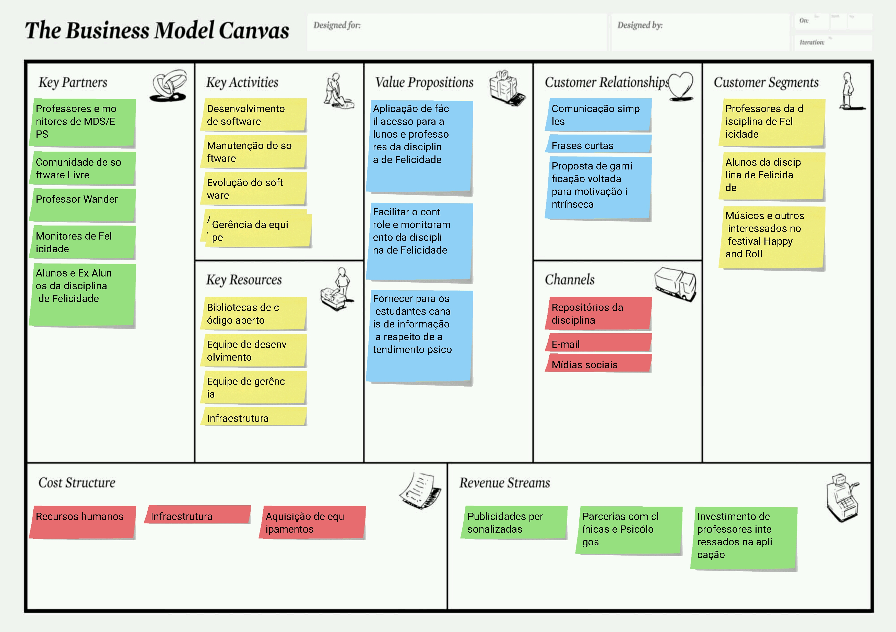

# Modelo de Negócios Canvas

## Sobre o Canvas

O Canvas é uma ferramenta de planejamento estratégico feito para esboçar modelos de negócio agrupados em 9 blocos, as ideias representadas nestes 9 blocos apresentam  a forma como irá operar e gerar valor no mercado listando seus principais fluxos, processos e segmentos.

# Primeira Versão

  
[Imagem Ampliada](https://raw.githubusercontent.com/fga-eps-mds/2019.2-Amika-Wiki/master/assets/img/canvas.png)

# Referências
> https://www.sebraepr.com.br/como-estruturar-seu-modelo-de-negocio/
