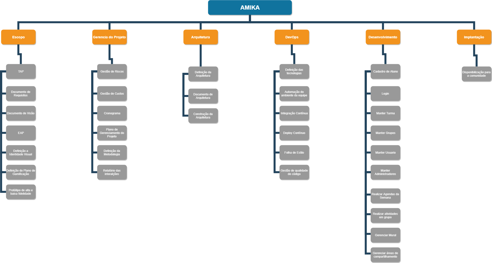

# Estrutura Analítica do Projeto(EAP)

### Histórico de Versão

 **Data** | **Versão** | **Descrição** | **Autor(es)**
---|:---:|---|---
13/09/2019| 0.1| Criação da primeira versão da EAP| Mateus de Oliveira

# Sobre a EAP

Segundo o PMBOK 5ª edição, a Estrutura Analítica do Projeto (EAP) é “O processo de subdivisão das entregas e do trabalho do projeto em componentes menores e mais facilmente gerenciáveis.” .

# Primeira Versão

  
[Imagem Ampliada](https://raw.githubusercontent.com/fga-eps-mds/2019.2-Amika-Wiki/issue_22_criar_eap/assets/img/EAP.png)

# Referências
> PMI. Um guia do conhecimento em gerenciamento de projetos. Guia PMBOK 5a. ed. - EUA: Project Management Institute, 2013.
