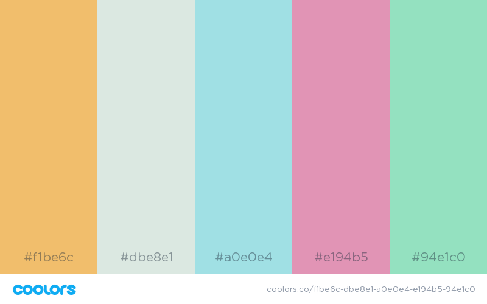
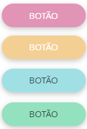
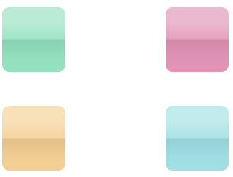

# Manual de Identidade Visual

# 1. Apresentação da Identidade Visual
<iframe src="https://docs.google.com/presentation/d/1v1N6yB3vohH2UAOoKPFNIUC1UijW7Tz1xB9x2DaNT-o/embed?start=false&loop=false&delayms=3000&slide=id.p"frameborder="0" width="960" height="569" allowfullscreen="true" mozallowfullscreen="true" webkitallowfullscreen="true"></iframe>

# 2. Introdução

## 2.1. Nome da aplicação

O nome da aplicação **Amika**, foi escolhido devido a significar "Amigável" em *Esperanto*
e o objetivo deste projeto era desenvolver uma aplicação que fosse amigável com seus usuários e causasse nestes sensações positivas
buscando sempre a felicidade e motivação do usuário enquanto utilizasse a aplicação.

Devido a esta natureza do nome, tanto a logo, quanto as fontes e esquema de cores se basearam nestes principios de serem amigáveis
com o usuário, buscando aquelas que tivessem uma maior aceitação e causassem estas sensações positivas nos usuários, como serão
explicados mais a frente neste documento.

## 2.2. Personalidade da Amika

A Amika, como seu nome sugere, possui uma personalidade agradável e simpática, sempre disposta a ajudar e de tratar seus usuários
de maneira pessoal, como se fosse alguem de sua própria familia.

## 2.3. Tipografia

As fontes utilizadas na aplicação serão:

 - **Ubuntu**(Ubuntu Font License), para a logo.
 - **Nunito** (Open Font License), para títulos e texto.

Para garantir maior harmonia entre as fontes, todas as escolhidas foram do tipo sans-serif, e foi utilizado o
[Google Fonts](https://fonts.google.com/?selection.family=Nunito|Ubuntu) para verificar a compatibilidade destas.
A utilização da familia sans-serif também foi feito devido a estas facilitarem a leitura de pessoas com dislexia por não
possuirem traços e hastes rebuscadas.

Além disso, estas fontes possuem boa adaptação para aplicações responsivas, como o deste projeto, adaptando-se para visualização web
e mobile e também possuem licença que permite uso gratuito.

### Uso das fontes

#### Incluindo no HTML

Coloca-se no <head> no layout base da aplicação o seguinte trecho de código:

	<link href="https://fonts.googleapis.com/css?family=Nunito|Ubuntu&display=swap" rel="stylesheet">

#### Incluindo no CSS

Coloca-se no css da aplicação, para a utilização das fontes:

  font-family: 'Ubuntu', sans-serif;
  font-family: 'Nunito', sans-serif;

# 2.4. Paleta de cores

As cores foram selecionadas buscando harmonização entre estas, e seguindo também guias da Psicologia das Cores
, como uma forma de buscar cores que causem sensações positivas como tranquilidade, felicidade e calma para os usuários.
A ferramenta utilizada para construi-la foi [coolors](https://coolors.co/f1be6c-dbe8e1-a0e0e4-e194b5-94e1c0). 

A cor primária é a cor #a0e0e4, e a cor secundária #94e1c0. Deve-se também utilizar de sombras alternativas destas para garantir um maior contraste e harmonia.

# 3. Componentes

## 3.1. Botões

Existem botões utilizando as diferentes cores da paleta, a depender do uso. O botão comum de confirmação é da cor primária. Os botões são arredondados (raio de 12 px) com texto escrito utilizando a fonte Raleway tamanho 14pt, semibold, todas letras maiúsculas. Observa-se ainda a cor da palavra escrita, a depender da cor do botão, para cumprir o contraste.

## 3.2. Campos de formulários

O texto acima do formulário, de label, é na fonte Raleway, tamanho 12 pt, regular, na cor primária,com uma margem de 20px a esquerda, em relação ao campo.
O campo possui raio de 12px arredondado, e bordas na cor primária.

## 3.3. Caixas

Apresenta-se a seguir algumas opções para utilizar como caixas ou *boxes* de navegação, tanto para a home page, quando para a página do administrador

