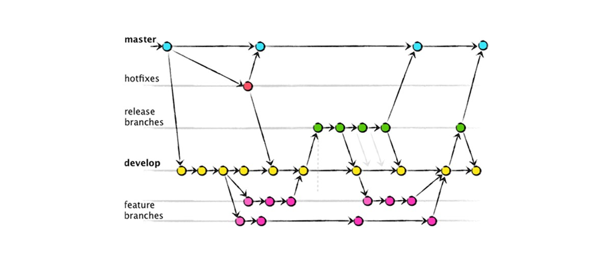

## Plano de Gerência de Configuração de Software
## 1.0 Política de Commits

Os commits devem ser feitos de forma sucinta, descrevendo o que foi feito. Eles devem ser atômicos e significativos, descrevendo o que foi implementado.

Exemplo - __Criando classe para administrador__

## 2.0 Política de Branches

Seguimos o modelo de branch do gitflow, como pode ser visto na imagem abaixo:

### 2.1 Repositório Amika frontend e repositório Amika backend
No repositório do projeto existem três branches principais para desenvolvimento: master, develop e release. A partir da develop são geradas as branches auxiliares contendo as funcinalidades desenvolvidas.

A master conterá a versão estável e já validada com o cliente, sendo seu conteúdo proveniente da branch release, que por sua vez é proveniente da branch develop.

A branch develop será utilizada para o desenvolvimento, onde a integração das funcionalidades desenvolvidas pela equipe nas branches auxiliares ocorrerá.

As branches auxiliares serão utilizadas para o desenvolvimento das funcionalidades, sendo elas nomeadas de acordo com a issue a qual ela é relacionada. O nome da branch será a identificação na issue, por exemplo: DOC01, US01 ou AMB01. Caso essa identificação não exista, será a palavra "issue" mais o número da issue presente no github. E após esse prefixo será colocado o nome da issue, separado por underline.

* Exemplo: __US01_cadastrar_usuario.__
* Exemplo: __issue_40_cadastrar_usuario.__

Para tratar eventuais bugs, será utilizado uma branch denominada de hotfix mais o nome do bug.

* Exemplo: __hotfix_remover_link__

### 2.2 Repositório Amika wiki
Existe uma diferença no repositório da wiki, pois nele não existe a branch develop. Essa opção foi feita por não existir um ambiente de homologação para o github pages. Desta forma, não existe a branch release e o pull request é feito direto na master. 

## 3.0 Política de Aprovação do Código

O nome do pull request será o nome da issue sendo feito de sua branch para a devel(exceto para o Amika Wiki que será para master).

A equipe de EPS é a responsável de avaliar os PRs se eles cumprem com os requisitos descritos.

## 4.0 Uso de Issues

As issues do github serão usadas para se ter um maior controle sobre o que se é desenvolvido as issues representarão as histórias de usuário, documentações do projeto, configurações do ambiente, treinamentos e bugs. 

Segue abaixo os tipos de issues existentes no projeto:

* __US__ -> História de usuário
* __AMB__ -> Configurações do ambiente
* __DOC__ -> Documentações do projeto
* __T__ -> Treinamento

Será cadastrada as tasks e os critérios de aceitação de cada história de usuário seguindo o template definido. A especificação da história de usuário seguirá o seguinte padrão: Eu, como <usuário> desejo <meta/desejo>, para <benefício>.

* Exemplo: __Eu, como administrador, desejo cadastrar novos usuários, para adicionar pessoas ao sistema.__

O nome das issues seguirão o seguinte padrão: [<Tipo de Issue> <identificador>] <Nome definido para a issue>.

* Exemplo: __[US01] Cadastrar usuários__.

