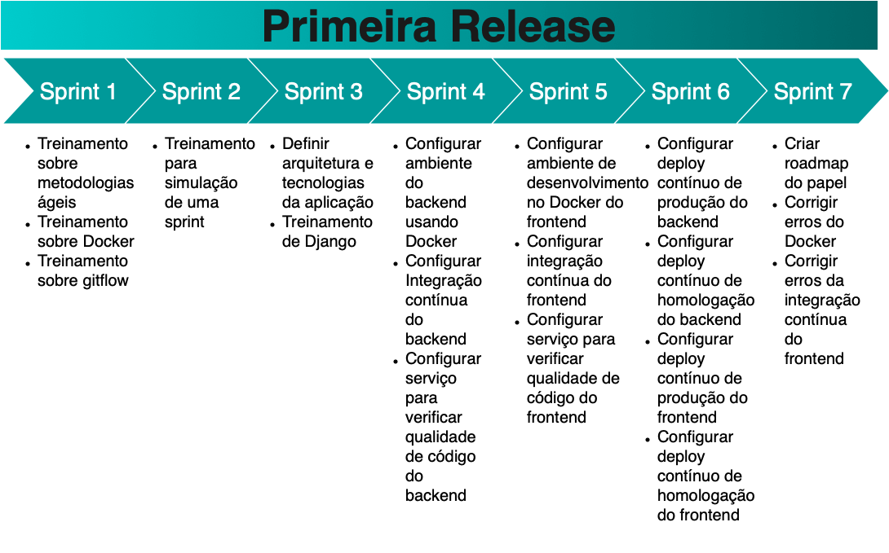
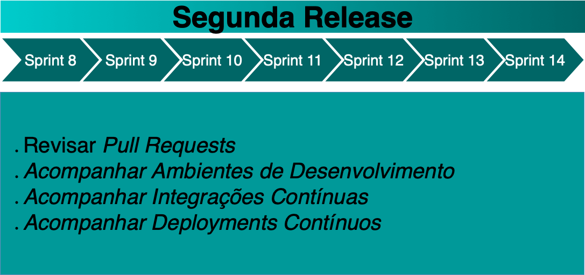

# Roadmap dos Papéis

## Roadmap do Product Owner

### Release 1

  
[Imagem Ampliada](https://raw.githubusercontent.com/fga-eps-mds/2019.2-Amika-Wiki/master/assets/img/roadmaps/Roadmap_po_r1.png)

### Release 2

  
[Imagem Ampliada](https://raw.githubusercontent.com/fga-eps-mds/2019.2-Amika-Wiki/master/assets/img/roadmaps/Roadmap_po_r2.png)

## Roadmap do DevOps

### Release 1

  
[Imagem Ampliada](https://raw.githubusercontent.com/fga-eps-mds/2019.2-Amika-Wiki/master/assets/img/roadmaps/Roadmap_devops_r1.png)

### Release 2

  
[Imagem Ampliada](https://raw.githubusercontent.com/fga-eps-mds/2019.2-Amika-Wiki/master/assets/img/roadmaps/Roadmap_devops_r2.png)

## Roadmap do Scrum Master

### Release 1

  
[Imagem Ampliada](https://raw.githubusercontent.com/fga-eps-mds/2019.2-Amika-Wiki/master/assets/img/roadmaps/Roadmap_sm_r1.png)

### Release 2

  
[Imagem Ampliada](https://raw.githubusercontent.com/fga-eps-mds/2019.2-Amika-Wiki/master/assets/img/roadmaps/Roadmap_sm_r2.png)
