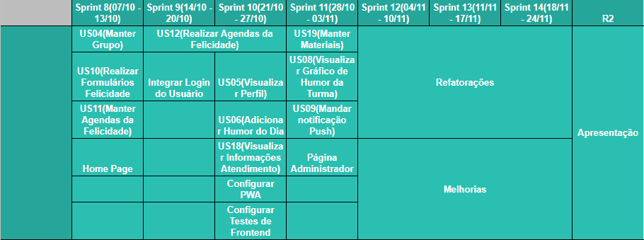

# RoadMap do Produto

## Versão 2

### Segunda Release
Esta versão foi gerada após a elaboração do [Mínimo Produto Viável](https://fga-eps-mds.github.io/2019.2-Amika-Wiki/#/docs/projeto/mvp) e foi voltada para a segunda Release, pois é a situação atual que a equipe se encontra.

  
[Imagem Ampliada](https://raw.githubusercontent.com/fga-eps-mds/2019.2-Amika-Wiki/master/assets/img/roadmaps/roadmapProdutov2.PNG)

## Versão 1

  
[Imagem Ampliada](https://raw.githubusercontent.com/fga-eps-mds/2019.2-Amika-Wiki/master/assets/img/roadmaps/roadmapProduto.png)

