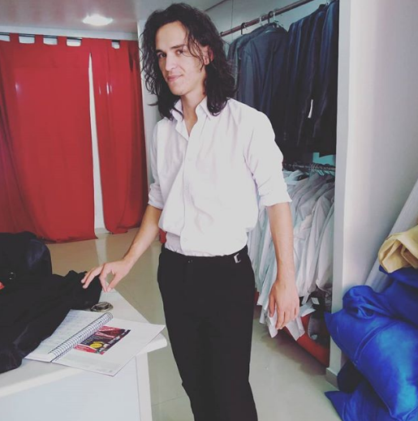

 
 

# Introdução

#### [Amika-Backend](https://github.com/fga-eps-mds/2019.2-Amika-Backend)

#### [Amika-Frontend](https://github.com/fga-eps-mds/2019.2-Amika-Frontend)

## Sobre
Amika é um Progressive Web App com o objetivo de auxiliar a organização da disciplina de Felicidade, assim como proporcionar para os alunos um ambiente de interação e ajuda para lidar com problemas de saúde mental, fornecendo assim uma experiência mais agradável.

## Colaboradores

### Equipe de Gerenciamento

 

  

    

        
            

              

                <a href="https://github.com/MateusO97">Mateus de Oliveira</a>
              

            

    

    

        
          

            

            <a href="https://github.com/Matheus456">Matheus Roberto</a>
            

          

    

    

    
        

          

          <a href="https://github.com/cantuariavc">Vinícius Cantuária</a>
          

        

    

  

### Equipe de Desenvolvimento

 

  

    

        
            

              

                <a href="https://github.com/ArthurPaivaT">Arthur Paiva</a>
              

            

    

    

        
          

            

            <a href="https://github.com/Danilow200">Danilo Domingo</a>
            

          

    

    

    
        

          

          <a href="https://github.com/Gabrielle-Ribeiro">Gabrielle Ribeiro</a>
          

        

        

    

    
        

          

          <a href="https://github.com/GustavoAPS">Gustavo Afonso</a>
          

        

        

    

    
        

          

          <a href="https://github.com/ithaloazevedo">Ithalo Luiz</a>
          

        

        

    

    
        

          

          <a href="https://github.com/MaiconMares">Maicon Lucas</a>
          

        

        

    

    
        

          

          <a href="https://github.com/thefael">Rafael da Silva</a>
          

        

        

    

  

## Contribuição

Para contribuir com o projeto, leia sobre [contribuição](https://github.com/fga-eps-mds/2019.2-Grupo9/blob/master/.github/CONTRIBUTING.md).

## Licença

Este projeto está licenciado sob os termos da [licença MIT](https://github.com/fga-eps-mds/2019.2-Amika-Wiki/blob/master/LICENSE).

Copyright (c) 2019 Amika