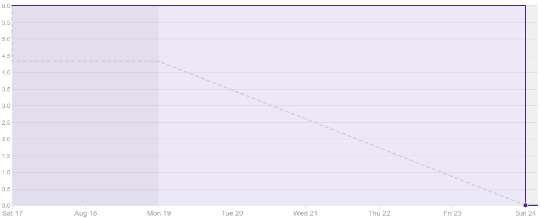

# 1. Revisão

| História | Foi concluída? |
| -------- | :----: |
| T01 - Realizar Treinamento Metodologia ágil | :white_check_mark: |
| T02 - Realizar treinamento Docker | :white_check_mark: |
| T03 - Realizar treinamento Gitflow | :white_check_mark: |

## 1.1 O que foi feito?
 * T01 - Realizar Treinamento Metodologia ágil (Treinamento)
 * T02 - Realizar treinamento Docker (Treinamento)
 * T03 - Realizar treinamento Gitflow (Treinamento)

## 1.2. O não foi feito e por que não foi feito?

  *  Não se aplica.

# 2. Retrospectiva

## 2.1. O que deu certo?  

* O time todo estava presente na reunião;
* Equipe de MDS realizou alguns dos treinamentos sugeridos;

## 2.2. O que deu errado? 

* Falta de disciplina para preencher a planilha de horas 
* Atraso na reunião

## 2.3. Como melhorar?
### 2.3.1. Must Have
* Realizar stand up;
* Treinamentos de tecnologias;

### 2.3.2. Nice To Have
* Intervalo durante a reunião

# 3. Burndown Chart

# 4. Velocity

# 5. Relato do Scrum Master

Nesta sprint deu para dar uma visão geral da metodologia que iremos usar, algumas dúvidas foram tiradas sobre a metodologia ágil, github e docker. 
