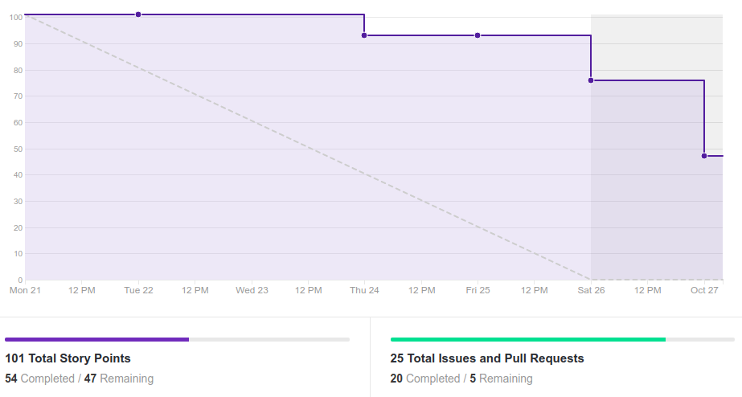
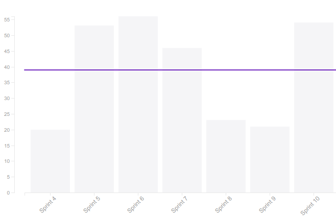
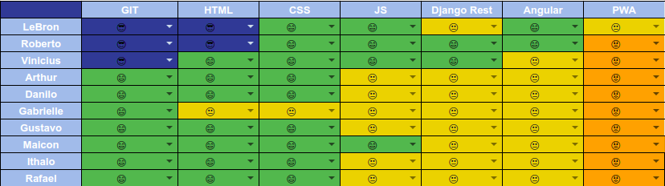

# Resultado da Sprint 10

 # 1. Revisão

| História | Foi concluída? |
| -------- | :----: |
| US01 - Cadastrar Usuário(Frontend) | :x: |
| US04 - Manter Grupo(Frontend) | :white_check_mark: |
| US10 - Realizar Formulários de felicidade autentica(Frontend) | :x: |
| US10 - Realizar Formulários de felicidade autentica(Backend) | :x: |
| US12 - Realizar agendas da felicidade(Frontend) | :x: | 
| US12 - Realizar agendas da felicidade(Backend) | :x: |
| US18 - Visualizar informações de atendimento psicológico | :white_check_mark: |
| DOC37 - Documentar resultado sprint 10 e planejamento sprint 10 | :white_check_mark: | 
| US06 - Adicionar humor do dia(back) | :white_check_mark:|
| US06 - Adicionar humor do dia(front) | :white_check_mark: |
| US05 - Visualizar perfil(back) | :white_check_mark: |
| US05 - Visualizar perfil(front) | :white_check_mark: |
| Configurar PWA | :white_check_mark: |
| Preparar treinamento testes do frontend | :x: |
| Integrar login do usuário com o sistema | :white_check_mark: |

## 1.1 O que foi feito?
* US04 - Manter Grupo(Frontend)
* US18 - Visualizar informações de atendimento psicológico
* US06 - Adicionar humor do dia(back)
* US06 - Adicionar humor do dia(front)
* DOC37 - Documentar resultado sprint 10 e planejamento sprint 10
* US05 - Visualizar perfil(back)
* US05 - Visualizar perfil(front)
* Configurar PWA
* Integrar login do usuário com o sistema

## 1.2. O não foi feito e por que não foi feito?
* US01 - Cadastrar Usuário(Frontend)
    * Falta consertar erro
* US10 - Realizar Formulários de felicidade autentica(Frontend)
    * Falta integração com o backend
    * Validações
* US10 - Realizar Formulários de felicidade autentica(Backend)
    * Não tinha aberto o PR
* US12 - Realizar agendas da felicidade(Frontend)
    * Falta parte lógica no backend
* US12 - Realizar agendas da felicidade(Backend)
    * Falta os testes do backend
* Preparar treinamento testes do frontend
    * Nada feito

# 2. Retrospectiva

## 2.1. O que deu certo?  
* Pareamento formado por duplas 
* Produtividade maior 
* Sábado somente para desenvolvimento
* Mais facilidade com a tecnologia

## 2.2. O que deu errado? 
* Começo tárdio de algumas USs
* Alguns pareamentos não aconteceram

## 2.3. Como melhorar?
* Não deixar para começar as USs no meio da sprint

# 3. Burndown Chart

# 4. Velocity

# 5. Quadro de Conhecimento

# 6. Burndown de Risco

# 7. Relato do Scrum Master

    Nessa sprint, apesar de ter sido a que fizemos mais pontos na parte de desenvolvimento, ainda houve um alto número de dívidas. E isso ocorreu principalmente pela falta de comprometimento de alguns membros do grupo de desenvolvimento e por conta da dificuldade técnica com as atividades, pois apesar de ter sido pego um alto número de pontos nessa sprint, nenhum pareamento ficou sobrecarregado.

    Foi visto a evolução de alguns membros da equipe de desenvolvimento em relação a independência da equipe de EPS.

