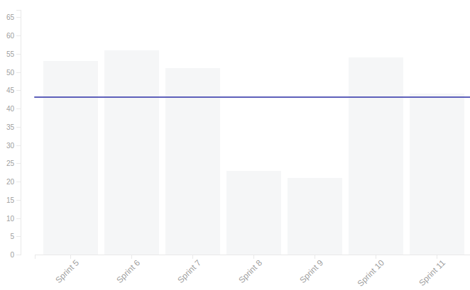
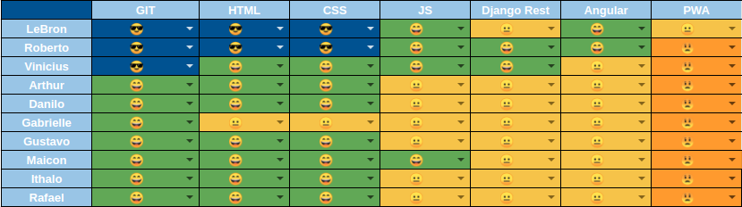
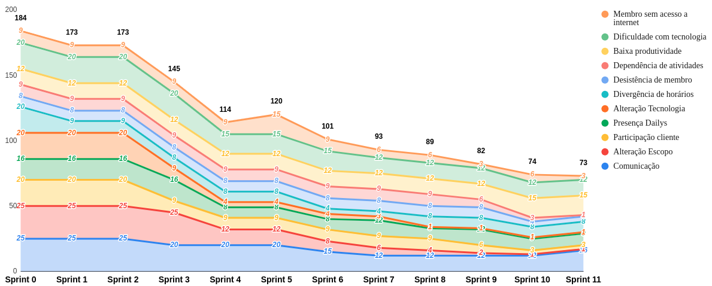

# Resultado da Sprint 11

 # 1. Revisão

| História | É Dívida Técnica? |
| -------- | :----: |
| US01 - Cadastrar Usuário(Frontend) | :white_check_mark: |
| US10 - Realizar Formulários de felicidade autentica(Frontend) | :white_check_mark: |
| US10 - Realizar Formulários de felicidade autentica(Backend) | :white_check_mark: |
| US12 - Realizar agendas da felicidade(Frontend) | :white_check_mark: |
| US12 - Realizar agendas da felicidade(Backend) | :white_check_mark: |
| US08 - Visualizar gráfico de humor do dia(Frontend) | :x: |
| US08 - Visualizar gráfico de humor do dia(Backend) | :x: |
| US19 - Manter materiais(Front) | :x: |
| US19 - Manter materiais(Backend) | :x: |
| Adicionando navbar e sidebar | :x: |
| Adicionando bottom navigation | :x: |
| Refatorar tela de turmas | :x: |
| DOC37 - Documentar resultado sprint 10 e planejamento sprint 11 | :x: |

## 1.1 O que foi feito?
* US01 - Cadastrar Usuário(Frontend)
* US19 - Manter materiais(Backend)
* Adicionando navbar e sidebar
* Adicionando bottom navigation
* Refatorar tela de turmas
* DOC37 - Documentar resultado sprint 10 e planejamento sprint 11
* US10 - Realizar Formulários de felicidade autentica(Backend)

## 1.2. O não foi feito e por que não foi feito?
* US10 - Realizar Formulários de felicidade autentica(Frontend)
    * Faltam os ajustes requisitados no PR
* US12 - Realizar agendas da felicidade(Frontend)
    * Falta a integração com o back
* US12 - Realizar agendas da felicidade(Backend)
    * Está faltando o método PUT e DELETE
* US08 - Visualizar gráfico de humor do dia(Frontend)
    * Falta receber os dados do back
* US08 - Visualizar gráfico de humor do dia(Backend)
    * Faltou a relação do humor com o aluno
* US19 - Manter materiais(Front)
    * Nada feito

# 2. Retrospectiva

## 2.1. O que deu certo?  
* Issues no repositório
* Design da página mais bonito 
* Maior noção da complexidade das histórias

## 2.2. O que deu errado? 
* Pareamento não aconteceu
* Baixo empenho do grupo
* Não priorizar USs em relação as issues
* Dificuldade de integração de novo membro na dívida
* Não preocupação com dívidas
* Descomprometimento do grupo nas reuniões
* Comunicação do grupo
* Dificuldade técnica

## 2.3. Como melhorar?
* Dar uma visão geral sobre como está o andamento do projeto
* Melhorar comunicação de MDS com EPS em relação as dúvidas

# 3. Burndown Chart

# 4. Velocity

# 5. Quadro de Conhecimento

# 6. Burndown de Risco

# 7. Relato do Scrum Master

    Nessa sprint a maior parte da equipe de MDS se empenhou muito pouco, sendo que as tarefas passadas apresentavam uma baixa complexidade, mas mesmo assim não conseguiram concluir. Quase todas as issues concluídas foram desenvolvidas pela equipe de EPS.

    A reunião de sábado foi cancelada por conta do feriado e a reunião do domingo(Revisão/Retrospectiva/Planejamento) foi feita com apenas 3 MDS e a equipe de EPS, sendo que 2 membros do grupo não deram nem satisfação da falta. A reunião de sábado fez muita falta, por ser o dia que todos desenvolvem juntos as suas atividades.

    A equipe de MDS tem muita dificuldade técnica para desenvolver as atividades, o que não era para estar acontecendo por conta dos treinamentos passados no começo do projeto. A maior parte dos membros tem dificuldade para criar um CRUD básico.

    O velocity da equipe não está sendo levado em conta para o planejamento, por conta da divisão das tarefas. Se o velocity fosse ser seguido, teriamos que pegar só o front ou o back de uma US, ou alterar o número de pessoas por pareamento, o que já foi feito e não deu certo. Mas como já foi citado anteriormente, as tarefas passadas não possuem uma complexidade tão grande para não serem feitas em uma semana. E nessa sprint, proporcionalmente, a maior parte dos pontos foram distribuidos entre a equipe de EPS. 

    O risco de comunicação aumento devido a dificuldade da comunicação entre alguns membros, sendo que um membro do grupo simplesmente desabilitou as notificações do telegram durante toda a semana, para não ser atrapalhado na preparação de uma prova.

