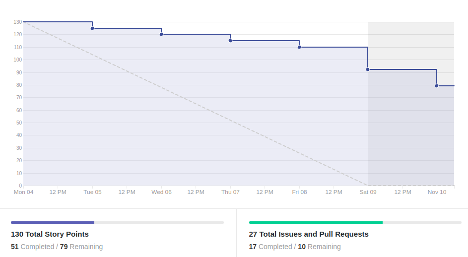
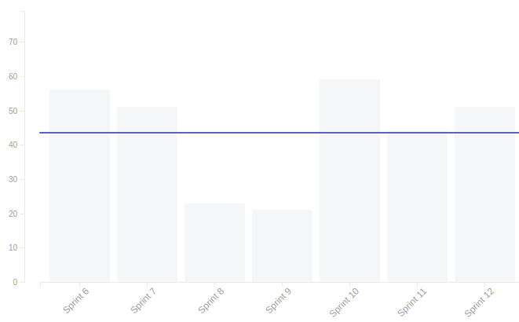
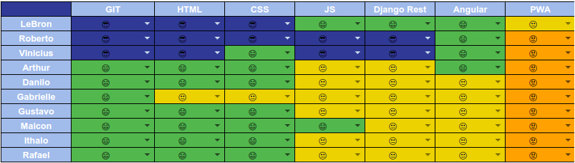
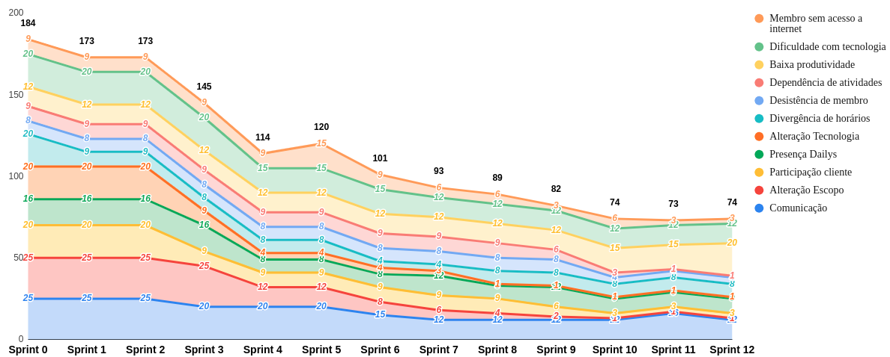

# Resultado da Sprint 12

 # 1. Revisão

| História | É Dívida Técnica? |
| -------- | :----: |
| US10 - Realizar Formulários de felicidade autentica(Frontend) | :white_check_mark: | 
| US12 - Realizar agendas da felicidade(Frontend) | :white_check_mark: |
| US12 - Realizar agendas da felicidade(Backend) | :white_check_mark: -  |
| US08 - Visualizar gráfico de humor do dia(Frontend) | :white_check_mark: |
| US08 - Visualizar gráfico de humor do dia(Backend) | :white_check_mark: |
| US19 - Manter materiais(Front) | :white_check_mark: |
| Adicionar spinner para carregamento de páginas | :x: |
| Adicionar imagem do usuário | :x: |
| Refatorar tela de adicionar humor | :x: | 
| Refatorar tela de cadastro | :x: |
| Refatorar tela de registro de matricula | :x: |
| Refatorar tela de criar agenda | :x: |
| Refatorar tela de grupos | :x: |
| Refatorar tela de visualizar informações de atendimento | :x: |
| DOC37 - Documentar resultado sprint 11 e planejamento sprint 12 | :x: |
| Treinamento teste de front | :x: |

## 1.1 O que foi feito?
* US08 - Visualizar gráfico de humor do dia(Frontend)
* US08 - Visualizar gráfico de humor do dia(Backend)
* Adicionar spinner para carregamento de páginas
* Adicionar imagem do usuário(Backend)
* Refatorar tela de adicionar humor
* Refatorar tela de cadastro
* Refatorar tela de grupos
* Refatorar tela de visualizar informações de atendimento
* DOC37 - Documentar resultado sprint 11 e planejamento sprint 12

## 1.2. O não foi feito e por que não foi feito?
* US10 - Realizar Formulários de felicidade autentica(Frontend)
* US12 - Realizar agendas da felicidade(Frontend)
    * Não está fazendo a parte de autenticação
* US12 - Realizar agendas da felicidade(Backend)
    * Não está fazendo a parte de autenticação
* US19 - Manter materiais(Front)
    * O pareamento não ocorreu e dificuldades foram encontradadas no último dia
* Adicionar imagem do usuário(Frontend)
    * Falta de entendimento do frontend
* Refatorar tela de registro de matricula
    * Não foi finalizada a estilização
* Refatorar tela de criar agenda
    * Falta aceitar PR
* Treinamento teste de front
    * Ng test roda, mas não dá feedback dos erros

# 2. Retrospectiva

## 2.1. O que deu certo?  
* Pareamento funcionou para alguns
* Comunicação entre membros de MDS e EPS
* Conhecimento da tecnologia para alguns membros do grupo 

## 2.2. O que deu errado? 
* Pareamento não funcionou para alguns
* Membros ausentes
* Daily
* Dificuldade com inicialização do ambiente

## 2.3. Como melhorar?
* Participação no daily pelo telegram
* Voltar a pedir o feedback antes da reunião

# 3. Burndown Chart

# 4. Velocity

# 5. Quadro de Conhecimento

# 6. Burndown de Risco

# 7. Relato do Scrum Master

