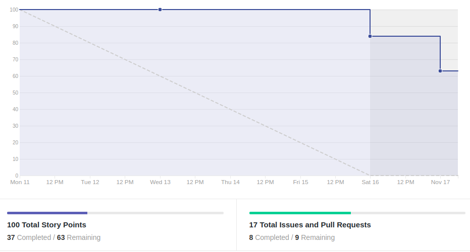
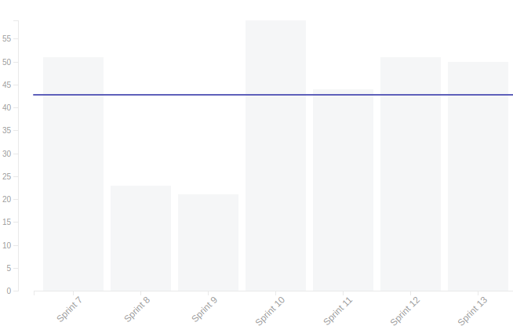
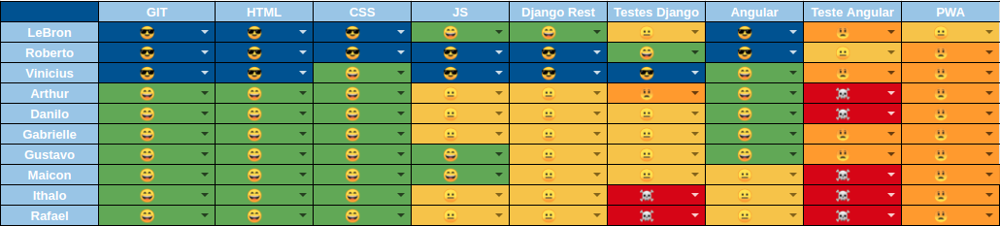
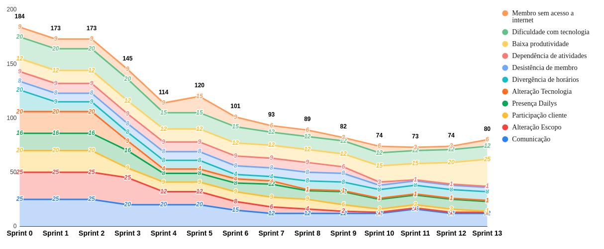

# Resultado da Sprint 13

 # 1. Revisão

| História | Foi concluída? |
| -------- | :----: |
| US10 - Realizar Formulários de felicidade autentica(Frontend) | :x: | 
| US12 - Realizar agendas da felicidade(Frontend) | :x: |
| US12 - Realizar agendas da felicidade(Backend) | :x: |
| Adicionar tela de grupos | :x: |
| Tratar erros de retorno do frontend| :x: |
| Adicionar imagem do usuário(Frontend) | :white_check_mark: |
| Teste de usabilidade com cliente | :white_check_mark: |
| Teste de front do componente turma | :white_check_mark: |
| DOC47 - Documentar resultado sprint 12 e planejamento sprint 13 | :white_check_mark: |
| Alterar componentes atuais para componentes do angular material | :white_check_mark: |
| Refatorar tela de registro de matricula| :x: |
| US19 - Manter materiais(Frontend) | :x: |
| Refatorar tela de criar agenda | :white_check_mark: |

## 1.1 O que foi feito?
* Teste de front do componente turma
* DOC47 - Documentar resultado sprint 12 e planejamento sprint 13
* Alterar componentes atuais para componentes do angular material
* Refatorar tela de criar agenda
* Adicionar imagem do usuário(Frontend)
* Teste de usabilidade com cliente

## 1.2. O não foi feito e por que não foi feito?
* US10 - Realizar Formulários de felicidade autentica(Frontend)

* US12 - Realizar agendas da felicidade(Frontend)
    * Falta fazer a parte mobile
    * Falta enviar o id do aluno

* US12 - Realizar agendas da felicidade(Backend)
    * Falta aceitar o pull request

* Adicionar tela de grupos

* Tratar erros de retorno do frontend
    * Responsável estava muito ocupado na semana

* US19 - Manter materiais(Frontend)
    * Falta fazer alguns ajustes

* Refatorar tela de registro de matricula

# 2. Retrospectiva

## 2.1. O que deu certo?  
* Pareamento para alguns membros do grupo
* Alguns membros do grupo de MDS com maior conhecimento da tecnologia
* Troca de conhecimento entre alguns membros do grupo

## 2.2. O que deu errado? 
* Semana comprometida com outras disciplinas
* Deixar tudo para fazer na reunião de sábado por alguns membros do grupo
* Falta comprometimento por alguns membros do grupo
* Dailys no telegram, poucas pessoas participam

# 3. Burndown Chart

# 4. Velocity

# 5. Quadro de Conhecimento

# 6. Burndown de Risco

# 7. Relato do Scrum Master

    Nesta sprint finalmente a equipe conseguiu iniciar os testes do frontend, que já vinha sendo requisitado há 3 sprints. Também foi feito o teste de usabilidade com o cliente, que foi muito interessante para saber quais pontos priorizar, mas poderia ter sido feito com uma maior antecedência. 

    Em relação a produtividade, a maior parte da equipe de MDS só foi começar a mexer nas issues da sprint na reunião de sábado e isso prejudicou muito o desenvolvimento. E além de começar no sábado, a maior parte da equipe apresenta muita dificuldade técnica com coisas básicas. Desta forma, acaba atrasando outras tarefas por conta da atenção que outros membros da equipe dão ajudar nas tarefas. Em relação ao começo tárdio do desenvolvimento, as justificativas são sempre as mesmas, de estar ocupado com outras matérias, ter provas na semana ou dificuldade técnica. Infelizmente a equipe de MDS não contribuiu com nenhum ponto nessa sprint e isso se dá bastante pelo descomprometimento da maior parte da equipe desde os primeiros treinamentos, no início do projeto.

    Algumas práticas do scrum estão sendo deixadas de lado por uma grande parte da equipe, mesmo isso sendo discutido toda semana continua sendo um problema recorrente. Um dos nossos acordos foi de fazer os dailys pelo telegam quando não fosse possível se reunir, mas a maioria do grupo não se dá o trabalho de participar. Para contornar essa situação, é feito um questionamento sobre o andamento das atividades no privado para cada membro que não participou do daily, mas por vezes demora dias para obter a resposta ou então a resposta é que ainda não começou a desenvolver. 

    Outro ponto que vem se tornando crítico na equipe é a falta de comprometimento com as reuniões de revisão/retrospectiva/planejamento das sprints, nesse domingo apenas 4 membros participaram de forma efetiva da reunião. Sendo que isso foi questionado no dia anterior para todos os membros do grupo, que colocaram como entrave a dificuldade de acordar no horário e a falta de internet.

    É possível notar com o velocity uma falta de coerência com a quantidade de pontos planejados na sprint, mas se for analisar mais a fundo, 50 pontos eram de dívidas que segundo os membros do grupo estavam próximas do término. Com isso, a maior parte de MDS foi designada para essas atividades, mas não conseguiram finalizar nenhuma. E se for analisar a participação da equipe durante a semana é notável que poucos membros se quer começaram a mexer na sua issue. E ao final da sprint isso fica claro, pois dos 50 pontos feitos, nenhum teve a participação da equipe de MDS, que é composta por 7 membros.  

    Uma das dificuldades da equipe de EPS nessa sprint foi a falta de tempo para fazer revisões de PRs, foi um dos motivos que atrapalhou a visualização do trabalho no burndown.

