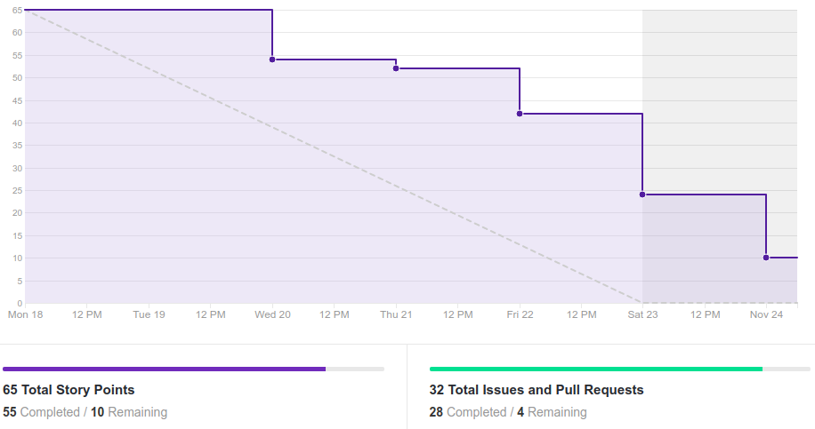
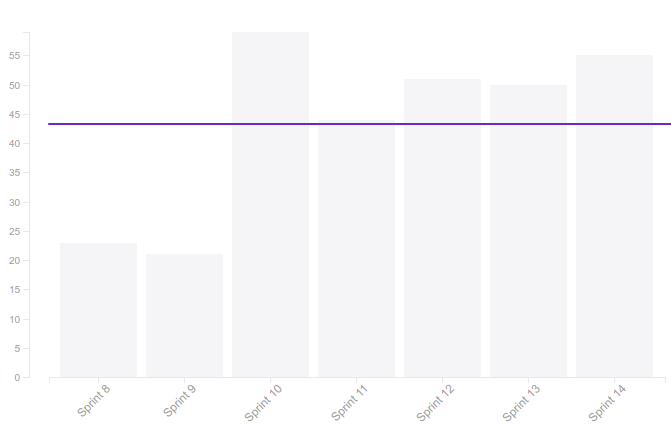
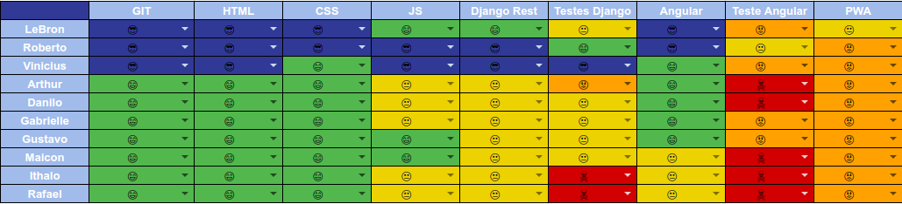
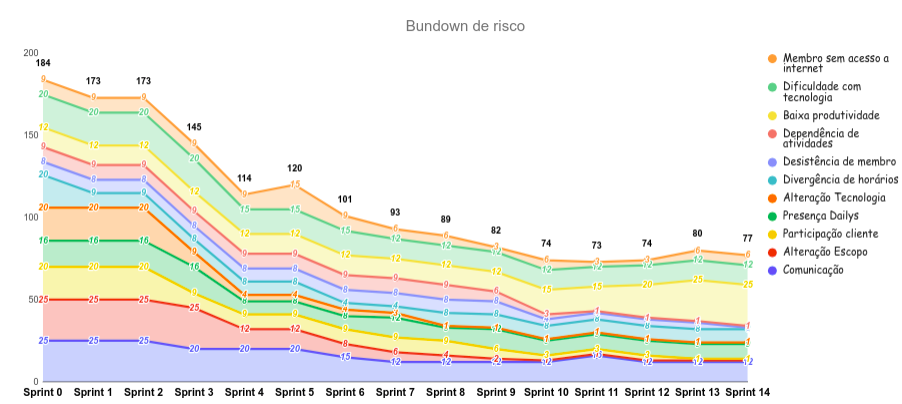

# Resultado da Sprint 14

 # 1. Revisão

| História | Foi concluída? |
| -------- | :----: |
| US12 - Realizar agendas da felicidade(Backend) | :white_check_mark: | 
| US12 - Realizar agendas da felicidade(Frontend) | :white_check_mark: |
| US19 - Manter materiais(Frontend) | :white_check_mark: | 
| Adicionar tela de grupos | :white_check_mark: | 
| Refatorar página de registro de matrículas | :white_check_mark: |
| Tratar erros de retorno do frontend | :white_check_mark: | 
| Feedback quando a ação for realizada com sucesso | :white_check_mark: | 
| Arrumar altura e largura da página mobile | :white_check_mark: | 
| Refatorar botões da versão mobile sobrexpostos pela bottom bar | :white_check_mark: |
| Alterar componentes da sidebar/bottombar do administrador | :white_check_mark: | 
| Alterar página inicial do administrador e do usuário | :white_check_mark: | 
| DOC47 - Documentar resultado sprint 13 e planejamento sprint 14 | :white_check_mark: | 
| DOC42 - Descrição do Postmortem  | :white_check_mark: | 
| Preparação para a 2ª Release | :white_check_mark: | 
| US10 - Realizar Formulários de felicidade autentica(Frontend) | :x: | 
| Arrumar altura e largura da página desktop | :white_check_mark: | 
| Colocar link para página inicial na logo do amika | :white_check_mark: | 
| Colocar imagens do projeto na wiki | :x: | 
| Colocar imagens dos alunos no grupos do administrador | :white_check_mark: | 

## 1.1 O que foi feito?
* US12 - Realizar agendas da felicidade(Backend) 
* US12 - Realizar agendas da felicidade(Frontend)
* US19 - Manter materiais(Frontend) 
* Adicionar tela de grupos 
* Refatorar página de registro de matrículas 
* Tratar erros de retorno do frontend 
* Feedback quando a ação for realizada com sucesso 
* Arrumar altura e largura da página mobile 
* Refatorar botões da versão mobile sobrexpostos pela bottom bar 
* Alterar componentes da sidebar/bottombar do administrador 
* Alterar página inicial do administrador e do usuário 
* DOC47 - Documentar resultado sprint 13 e planejamento sprint 14 
* DOC42 - Descrição do Postmortem  
* Preparação para a 2ª Release 

## 1.2. O não foi feito e por que não foi feito?
* US10 - Realizar Formulários de felicidade autentica(Frontend)
* Colocar imagens do projeto na wiki

# 2. Retrospectiva

## 2.1. O que deu certo?  
* Poucas dívidas
* Troca de conhecimento entre alguns membros do grupo

## 2.2. O que deu errado? 
* Falta comprometimento por alguns membros do grupo
* Semana comprometida com outras disciplinas
* Dailys no telegram, poucas pessoas participam

# 3. Burndown Chart

# 4. Velocity

# 5. Quadro de Conhecimento

# 6. Burndown de Risco

