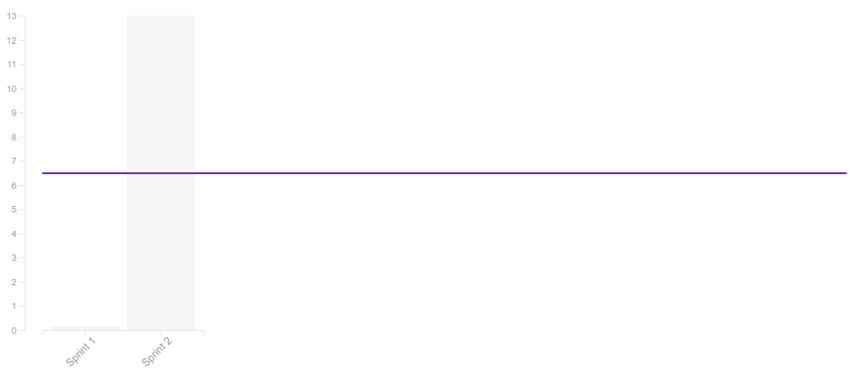

# Sumário

1. [Revisão](#1-revisão)

2. [Retrospectiva](#2-retrospectiva)

3. [Burndown Chart](#3-burndown-chart)

4. [Velocity](#4-velocity)

5. [Relato do Scrum Master](#5-relato-do-scrum-master)

---

# 1. Revisão

| História | Foi concluída? |
| -------- | :----: |
| T04 - Simular uma sprint | :white_check_mark: |

## 1.1 O que foi feito?
 * T04 (Treinamento)

## 1.2. O não foi feito e por que não foi feito?

  * Não se aplica.

# 2. Retrospectiva

## 2.1. O que deu certo?  

* Pareamento foi produtivo;
* Entender melhor o funcionamento do django;
* Suporte entre time de MDS e EPS;

## 2.2. O que deu errado? 

* Falta de planejamento dos horários do stand up
* Pareamento em trio
* Horários da reunião

## 2.3. Como melhorar?
### 2.3.1. Must Have
* Controlar horários do Stand up
* Treinamentos de tecnologias;

### 2.3.2. Should Have
* Definir horários dos pareamentos no dia da alocação

### 2.3.3. Could Have
* Trio nivelado
* Intervalo com lanche

# 3. Burndown Chart

 Como citado anteriormente, a inexperiência do time comprometeu o desenvolvimento das histórias. Isso vê-se refletido no _burndown_, onde a maior parte das histórias não foi concluída. Além disso, percebe-se que os pontos começaram a ser queimados tardiamente (4 dias depois do início da sprint).

Na sprint seguinte, deve-se fazer um esforço para que os pontos sejam não apenas queimados mais cedo, mas queimados por completo, não deixando dívidas. 

# 4. Velocity

 Devido à quantidade de histórias não concluídas, o velocity do time ficou bem abaixo do número de pontos planejados. 

Na próxima sprint, a equipe deverá quitar as dívidas deixadas e cumprir um planejamento com um número menor de pontos, de forma equilibrada à produtividade observada. 

# 5. Relato do Scrum Master

A simulação de uma sprint ambientalizou todos os integrantes do grupo sobre as etapas da metodologia ágil. O grupo se comportou muito bem no sábado, onde teve a reunião presencial, mas após a reunião a maior parte dos integrantes se depararam com muitas dificuldades em relação a tecnologia que usamos.  

