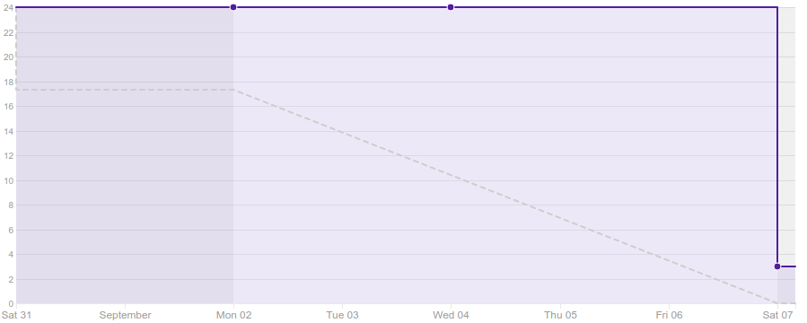
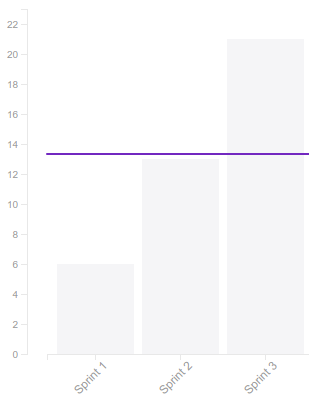
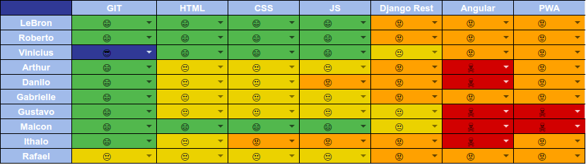
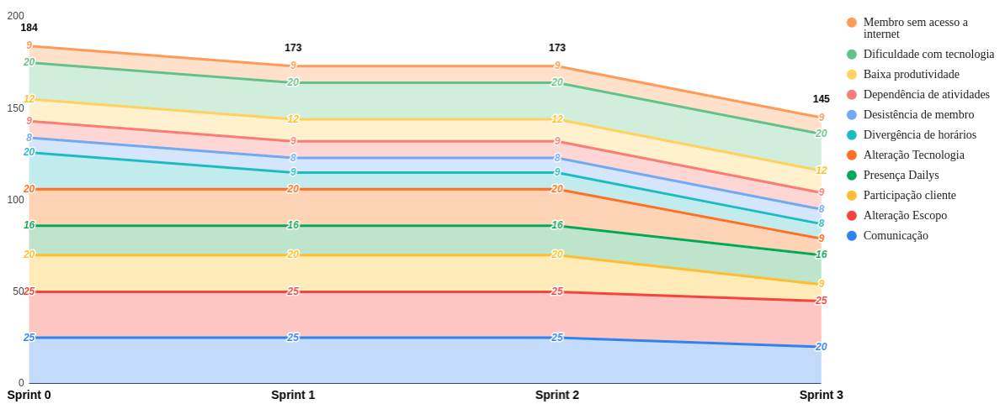

# Resultado da Sprint 3

 # 1. Revisão

| História | Foi concluída? |
| -------- | :----: |
| DOC01 - Criar documento de visão | :x: |
| DOC02 - Criar termo de abertura do projeto (TAP) | :white_check_mark: |
| DOC03 - Definir esquema de cores | :white_check_mark: |
| DOC04 - Definir nome da aplicação | :white_check_mark: |
| DOC05 - Criar logotipo | :white_check_mark: |
| DOC06 - Criar protótipo de alta fidelidade | :x: |
| DOC07 - Adicionar atas de reunião | :white_check_mark: |

## 1.1 O que foi feito?
* Issue 19: Configurar Github Pages
* DOC03 - Esquema de cores
    * Falta ser validado com o cliente
* DOC02 - Termo de Abertura do Projeto
    * Falta ser aceito o pull request
* DOC04 - Definir nome da aplicaçao
    * Falta ser validado com o cliente

* Issue 13: Criação das atas
    * Falta ser aceito o pull request
* Issue 26: Criação de logos
    * Falta ser validado com o cliente

## 1.2. O não foi feito e por que não foi feito?

*  DOC01 - Documento de visão
    * Faltou subir as alterações feitas no github
    * Membro do grupo não entregou a tempo
*  DOC06 - Criar protótipo de alta fidelidade
    * Ainda será necessário adicionar alterações

# 2. Retrospectiva

## 2.1. O que deu certo?  

* Divisão de tarefas no documento de visão
* Reunião com o cliente
* Material de apoio

## 2.2. O que deu errado? 

* Comunição
* Definição de horários
* Membro ausente
* Cobrança
* Daily
* Planilha de horas

## 2.3. Como melhorar?

### 2.3.1. Must Have
* Visualização de mensagens e feedback
* Mais compromisso nos dailys
* Disciplina com a planilha de horas

# 3. Burndown Chart

# 4. Velocity

# 5. Quadro de Conhecimento

# 6. Burndown de Risco

# 7. Relato do Scrum Master

Nosso maior problema, nesta sprint, foi a definição tardia do tema do projeto a ser desenvolvido. Com esse atraso, não foi possível definir o escopo.

Por conta da falta de definição e validação do escopo com o cliente, houveram atrasos nas aceitações de alguns pull requests.

Devido a esses contra-tempos, o burndown não mostra de forma fiel como foi a produtividade da equipe.

