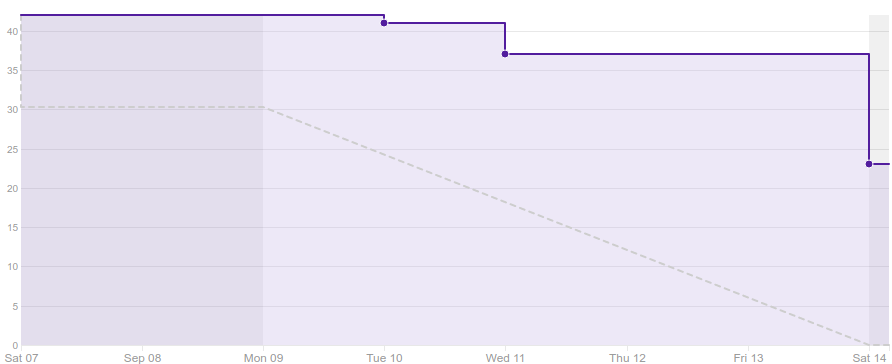
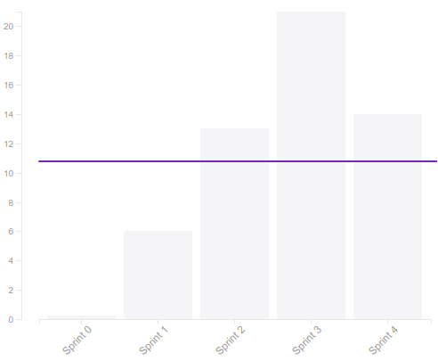
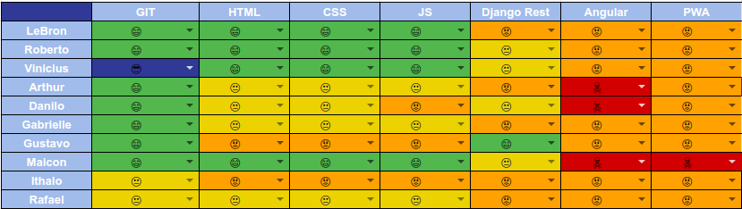

# Resultado da Sprint 4

 # 1. Revisão

| História | Foi concluída? |
| -------- | :----: |
| DOC01 - Criar documento de visão | :white_check_mark: |
| US01 - Cadastrar Usuário(backend) | :x: |
| AMB01 - Configurar Ambiente de Desenvolvimento do backend (Docker) | :white_check_mark: |
| AMB02 - Configurar um serviço para fazer integração contínua do backend | :white_check_mark: |
| AMB03 - Configurar Deploy continuo de produção do backend | :x: |
| AMB04 - Configurar um serviço para supervisionar qualidade do backend | :white_check_mark: |
| DOC08 - Definir Tecnologia  | :white_check_mark: |
| DOC09 - Definir Backlog | :white_check_mark: |
| DOC10 - Criar EAP | :x: |
| DOC11 - Documentar Sprints | :white_check_mark: |

## 1.1 O que foi feito?
*  DOC01 - Criar documento de visão
*  AMB01 - Configurar Ambiente de Desenvolvimento do backend (Docker)
*  AMB02 - Configurar um serviço para fazer integração contínua do backend
*  AMB04 - Configurar um serviço para supervisionar qualidade do backend
*  DOC08 - Definir Tecnologia
*  DOC09 - Definir Backlog
*  DOC11 - Documentar Sprints

## 1.2. O não foi feito e por que não foi feito?

*  US01 - Cadastrar Usuário(backend)
    * Faltou subir as alterações feitas no github
    * Membro do grupo não entregou a tempo
*  DOC10 - Criar EAP
*  AMB03 - Configurar Deploy continuo de produção do backend

# 2. Retrospectiva

## 2.1. O que deu certo?  

* Pareamentos
* Estudo sobre a tecnologia
* Dailys
* Comunicação via hangouts

## 2.2. O que deu errado? 

* Membro do grupo sem internet
* Falta de tempo dos membros
* Revisão de pull requests tárdia
* Falta de conhecimento da equipe
* Issues interligadas

## 2.3. Como melhorar?

* Definir horários fixos para pareamento
* Melhorar comunicação entre EPS e MDS(Dúvidas foram levadas até o fim da sprint)
* Treinamento prévio das tecnologias 
* Pareamento para estudo

# 3. Burndown Chart

# 4. Velocity

# 5. Quadro de Conhecimento

# 6. Relato do Scrum Master

    A falta de conhecimento do grupo com a tecnologia foi a maior dificuldade encontrada nesta sprint, por conta disso, foi gasto muito tempo para estudar a tecnologia antes de iniciar o desenvolvimento. 

    Outro ponto negativo foi a comunicação, pois nessa sprint foi passado apenas a parte do backend para desenvolver, porém isso não ficou claro para a equipe de desenvolvimento, que não sabia como desenvolver o backend sem mexer no frontend, e essa dúvida foi levada até o final da sprint.

    Nessa sprint conseguimos criar um bom número de documentos e configurar o ambiente de desenvolvimento do backend.

