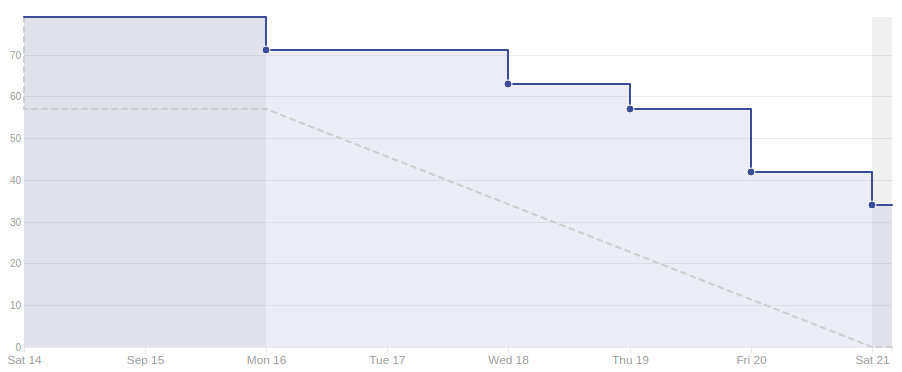
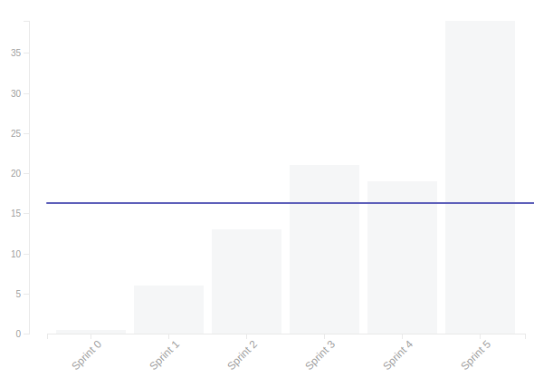
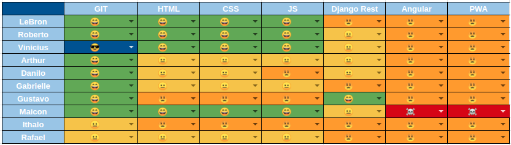
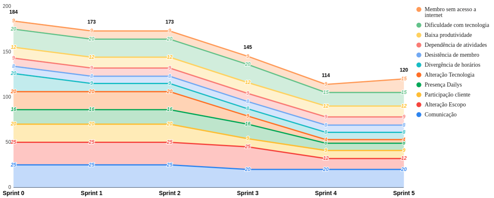

# Resultado da Sprint 5

 # 1. Revisão

| História | Foi concluída? |
| -------- | :----: |
| US01 - Cadastrar Usuário(backend) | :x: |
| DOC10 - Criar EAP | :white_check_mark: |
| DOC12 - Documento de arquitetura | :x: |
| DOC13 - Plano de comunicação | :white_check_mark: |
| DOC14 - Plano de gerenciamento riscos | :white_check_mark: |
| DOC15 - Documento de contribuição | :white_check_mark: |
| DOC16 - Priorização de issues | :white_check_mark: |
| DOC17 - Roadmap do produto | :white_check_mark: |
| AMB03 - Configurar Deploy continuo de produção do backend | :x: | 
| AMB05 - Configurar Deploy continuo de homologação do backend | :x: | 
| AMB06 - Configurar Ambiente de Desenvolvimento do frontend (Docker) | :white_check_mark: | 
| AMB07 - Configurar um serviço para fazer integração contínua do frontend | :white_check_mark: | 
| AMB08 - Configurar Deploy continuo de produção do frontend | :x: | 
| AMB09 - Configurar Deploy continuo de homologação do frontend | :x: | 
| AMB10 - Configurar codeclimate do frontend | :white_check_mark: |
| DOC18 - Documentar resultado sprint 4 e planejamento sprint 5 | :white_check_mark: |

## 1.1 O que foi feito?

* DOC10 - Criar EAP
* DOC13 - Plano de comunicação 
* DOC14 - Plano de gerenciamento riscos 
* DOC15 - Documento de contribuição 
* DOC16 - Priorização de issues 
* DOC17 - Roadmap do produto 
* AMB06 - Configurar Ambiente de Desenvolvimento do frontend (Docker)  
* AMB07 - Configurar um serviço para fazer integração contínua do frontend  
* AMB10 - Configurar codeclimate do frontend 
* DOC18 - Documentar resultado sprint 4 e planejamento sprint 5 

## 1.2. O não foi feito e por que não foi feito?

* US01 - Cadastrar Usuário(backend) 
* DOC12 - Documento de arquitetura 
* AMB03 - Configurar Deploy continuo de produção do backend  
* AMB05 - Configurar Deploy continuo de homologação do backend  
* AMB08 - Configurar Deploy continuo de produção do frontend  
* AMB09 - Configurar Deploy continuo de homologação do frontend  

# 2. Retrospectiva

## 2.1. O que deu certo?  

* Evolução no conhecimento da tecnologia
* Pareamento maior para parte da documentação
* Procura de MDS para tirar dúvidas
* Suporte EPS em relação a materiais e ajuda na resolução de problemas
* Compromisso com o pareamento
* Revisão dos pull requests

## 2.2. O que deu errado? 

* Falta de compromisso de MDS
* Falta de organização do doc de arquitetura
* Todos bem perdidos em relação ao projeto
* Faltou organização e comunicação com as outras duplas
* Menos tempo disponível de MDS
* Deixando muita coisa acumular
* Daily não funcionou muito bem
* Dificuldades técnicas
* Trabalhos começando tarde
* Muitas histórias alocadas
* Problemas com organização e definição das branches da Wiki

## 2.3. Como melhorar?

* Treinamento prévio de tecnologias que serão utilizadas
* Maior disciplina dos desenvolvedores

# 3. Burndown Chart

# 4. Velocity

# 5. Quadro de Conhecimento

# 6. Burndown de Risco

# 7. Relato do Scrum Master

Nesta sprint houve uma aparente falta de disciplina de muitas pessoas do grupo de desenvolvimento(MDS), e com isso todas as atividades que foram passadas a equipe não foram concluídas.

Ocorreu uma melhora em relação à criação de documentações por parte dos gerentes, pois os documentos foram entregues ao decorrer da sprint, tivemos apenas um problema em relação ao fechamento de issues pois mesmo após a aceitação do pull request muitas continuaram abertas, prejudicando a visualização no burndown. 

Os gerentes do grupo estavam muito empenhados em relação a revisão de pull request, foi um dos pontos negativos citados na última reunião, e nessa foi um ponto positivo. Os feedbacks de maneira muito rápida, assim como a resolução das sugestões requisitadas.

