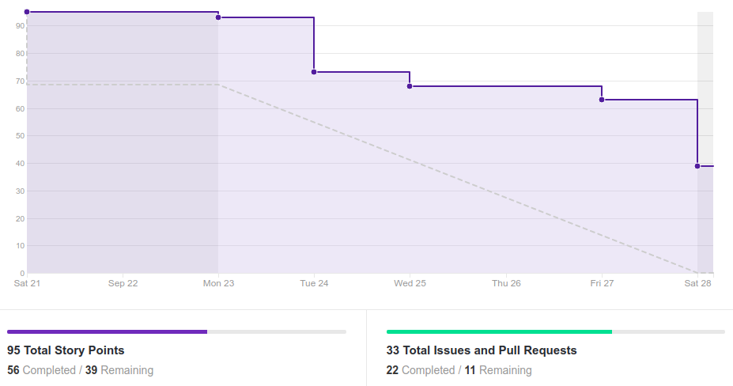
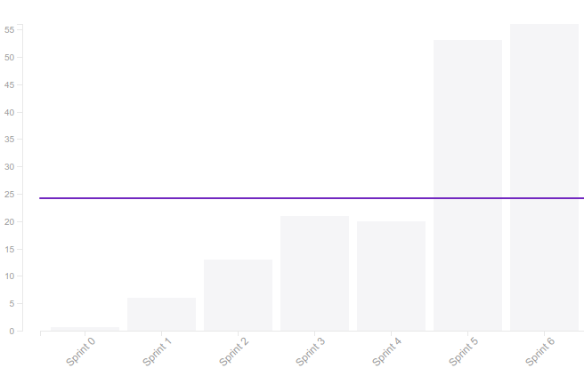
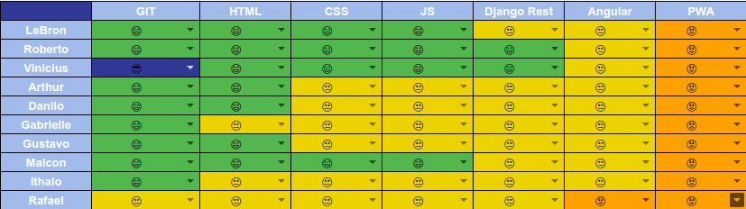
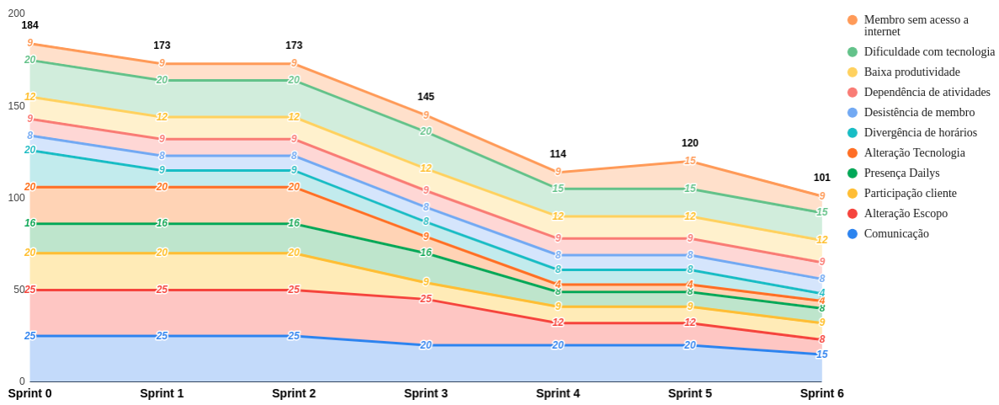

# Resultado da Sprint 6

 # 1. Revisão

| História | Foi concluída? |
| -------- | :----: |
| US01 - Cadastrar Usuário | :x: |
| US02 - Manter turma | :x: |
| US03 - Auto gerenciar matricula | :x: |
| DOC12 - Documento de arquitetura | :white_check_mark: |
| DOC20 - Adicionando Roadmap do Product Owner | :white_check_mark: |
| DOC22 - Canvas do projeto | :white_check_mark: |
| DOC23 - Adicionar Manual de Identidade Visual da aplicação | :white_check_mark: |
| DOC24 - Refatorar wiki | :x: |
| DOC25 - Plano de metodologia | :x: |
| DOC26 - Criar EVM | :x: |
| DOC27 - Definição de pronto | :white_check_mark: |
| DOC28 - Roadmap do Scrum Master | :white_check_mark: |
| DOC30 - Burndown Riscos | :white_check_mark: |
| DOC32 - Documentar resultado sprint 5 e planejamento sprint 6 | :white_check_mark: |
| DOC33 - Criar Especificação dos casos de uso | :white_check_mark: |
| AMB03 - Configurar Deploy continuo de produção do backend | :white_check_mark: | 
| AMB05 - Configurar Deploy continuo de homologação do backend | :white_check_mark: | 
| AMB08 - Configurar Deploy continuo de produção do frontend | :white_check_mark: | 
| AMB09 - Configurar Deploy continuo de homologação do frontend | :white_check_mark: | 

## 1.1 O que foi feito?
* DOC12 - Documento de arquitetura 
* DOC20 - Adicionando Roadmap do Product Owner 
* DOC22 - Canvas do projeto 
* DOC23 - Adicionar Manual de Identidade Visual da aplicação 
* DOC27 - Definição de pronto 
* DOC28 - Roadmap do Scrum Master 
* DOC30 - Burndown Riscos 
* DOC32 - Documentar resultado sprint 5 e planejamento sprint 6 
* DOC33 - Criar Especificação dos casos de uso
* AMB03 - Configurar Deploy continuo de produção do backend  
* AMB05 - Configurar Deploy continuo de homologação do backend  
* AMB08 - Configurar Deploy continuo de produção do frontend  
* AMB09 - Configurar Deploy continuo de homologação do frontend  

## 1.2. O não foi feito e por que não foi feito?
* US03 - Auto gerenciar matricula 
    - Faltou apenas aceitar o PR

* US01 - Cadastrar Usuário 
    - Não foi finalizado

* US02 - Manter turma 
    - Não foi finalizado

* DOC24 - Refatorar wiki 
* DOC25 - Plano de metodologia 
* DOC26 - Criar EVM 

# 2. Retrospectiva

## 2.1. O que deu certo?  

* Pareamento EPS/MDS
* Ajuda de EPS
* Evolução de EPS com as tecnologias
* Semana universitária
* Pareamento contínuo(4 horas por dia)
* Integração entre a equipe
* Comprometimento do MDS com os horários
* Configuração do Ambiente

## 2.2. O que deu errado? 

* Comprometimento de alguns membros
* Problemas técnicos
* Falta de comunicação de alguns membros
* Distribuição de atividades
* Atraso de documentos
* Começo tardio de atividades
* Membros ausentes

## 2.3. Como melhorar?

* Distribuição de atividades
* Estudo prévio de MDS antes do pareamento
* Comunicação
* Atenção nos stand ups
* Compartilhamento de informação entre pareamentos

# 3. Burndown Chart

# 4. Velocity

# 5. Quadro de Conhecimento

# 6. Burndown de Risco

# 7. Relato do Scrum Master

O pareamento entre as equipes de MDS e EPS foi fundamental para o andamento da sprint, boa parte do grupo de MDS conseguiu evoluir bem o conhecimento sobre as tecnologias utilizadas. O que ajudou bastante também foi ter dedicado 4 horas por dia de pareamento presencial, isso foi crucial para o andamento da sprint.

Dois membros do grupo viajaram, o que acabou atrapalhando um pouco os pareamentos. Mas ainda assim foi possível fazer o pareamento via hangouts e desenvolver a história. 

Mesmo com as dívidas que ficaram para essa sprint, foi notável a evolução do grupo nessa sprint. O grupo se mostrou mais motivado com o projeto e com a tecnologia que estamos usando. Ainda assim, apresentaram descompromentimento em relação aos documentos, pois deixaram para fazer o pull request apenas ao final da sprint

Uma das coisas que pesou muito foi a sobrecarga para a equipe de EPS, pois apesar do comprometimento da equipe de MDS em participar dos pareamentos presenciais, eles não exerceram esse mesmo comprometimento em casa para estudar a tecnologia. Com isso, a equipe de EPS teve que se empenhar para aprender a tecnologia antes dos pareamentos e na hora do pareamento explicar tudo do zero. Isso demandou um esforço grande da equipe de EPS, pois essa tecnologia nova para todos do grupo.

Tendo em vista os documentos que deveriam ser entregues na R1, a equipe de EPS pegou uma quantidade enorme de documentos, que acabou causando novas dívidas e um maior estresse para a equipe de EPS. A quantidade de documentos, apesar de grande, era vista como viável para alguns membros de EPS por conta da semana universitária, mas acabou que o tempo para estudar a tecnologia dificultou a entrega desses documentos.

