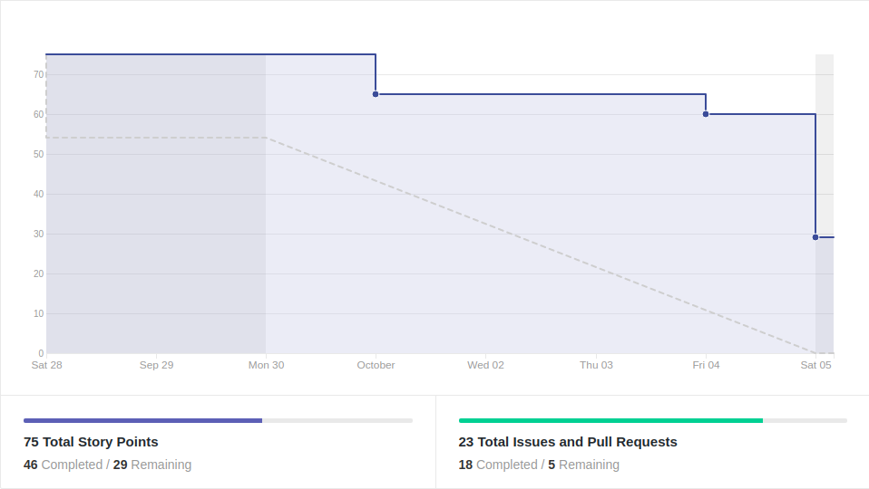
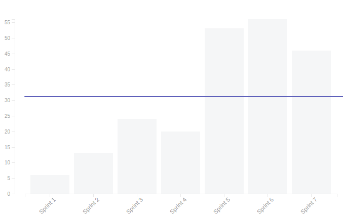
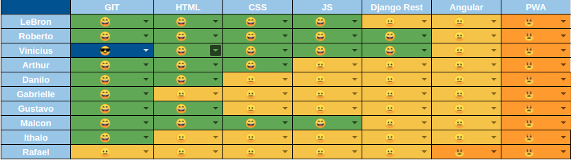
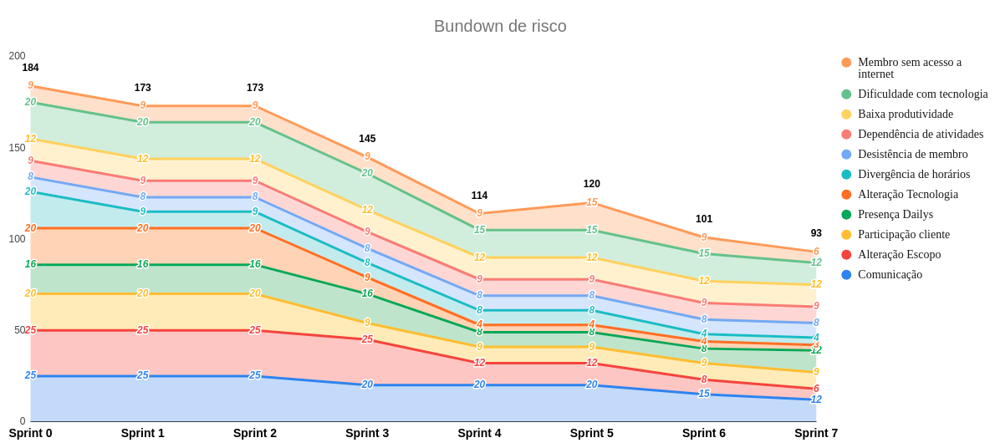

# Resultado da Sprint 7

 # 1. Revisão

| História | É Dívida Técnica? |
| -------- | :----: |
| US01 - Cadastrar Usuário | :white_check_mark: |
| US02 - Manter turma | :white_check_mark: |
| US03 - Auto gerenciar matricula | :white_check_mark: |
| DOC24 - Refatorar wiki | :white_check_mark: |
| DOC25 - Plano de metodologia | :white_check_mark: |
| DOC26 - Criar EVM | :white_check_mark: |
| DOC31 - Documentar Roadmap de Deploy | :x: |
| DOC34 - Documentar resultado sprint 6 e planejamento sprint 7 | :x: |
| DOC35 - Preparação para entrega da 1ª Release | :x: |
| Criar Home Page | :x: |
| Criar Página do administrador | :x: |
| Adicionar identidade visual na aplicação | :x: |

## 1.1 O que foi feito?
* US03 - Auto gerenciar matricula
* DOC24 - Refatorar wiki
* DOC25 - Plano de metodologia
* DOC26 - Criar EVM
* DOC31 - Documentar Roadmap de Deploy
* DOC34 - Documentar resultado sprint 6 e planejamento sprint 7

## 1.2. O não foi feito e por que não foi feito?
* US01 - Cadastrar Usuário
    * Front não está com a parte funcional funcionando
* US02 - Manter turma
    * Refatoração de código
* Criar Página do administrador
* Adicionar identidade visual na aplicação
    * Falta de tempo para pareamento
* Página do Admin 
    * Priorização baixa
* Criar Home Page  
    * Faltaram alguns ajustes no Pull Request

# 2. Retrospectiva

## 2.1. O que deu certo?  

* Troca de conhecimento entre EPS e MDS
* Implementação de funcionalidade com base em outro pareamento
* Pareamento produtivo
* Empenho dos MDS no início da semana
* Cobrança entre MDS's

## 2.2. O que deu errado? 

* Sobrecarga de tarefas, por conta das refatorações necessárias
* Dificuldade de horário para pareamento
* Códigos complicados de entender
* Apareceram muitos problemas para serem resolvidos
* Os dailys não aconteceram todos os dias
* Falta de planejamento de membros

## 2.3. Como melhorar?

* Deixar claro os horários que cada um tem
* Diminuir a quantidade de atividades, com base nos horários livres da semana

# 3. Burndown Chart

# 4. Velocity

# 5. Quadro de Conhecimento

# 6. Burndown de Risco

# 7. Relato do Scrum Master

    Nesta sprint houve muita refatoração nas histórias de usuário que estavam praticamente prontas. O que foi bom para melhorar a qualidade do nosso código, mas ao mesmo tempo atrapalho no andamento da sprint.
    Os dailys não ocorreram da forma esperada, só aconteceu daily presencial na segunda e na terça. Nos outros dias era para acontecer o daily online, mas não funcionou bem, sendo que muitos membros não participaram.
    Perdemos muito tempo com o ambiente, algumas vezes por desconhecimento e outras por falha do ambiente mesmo. 

