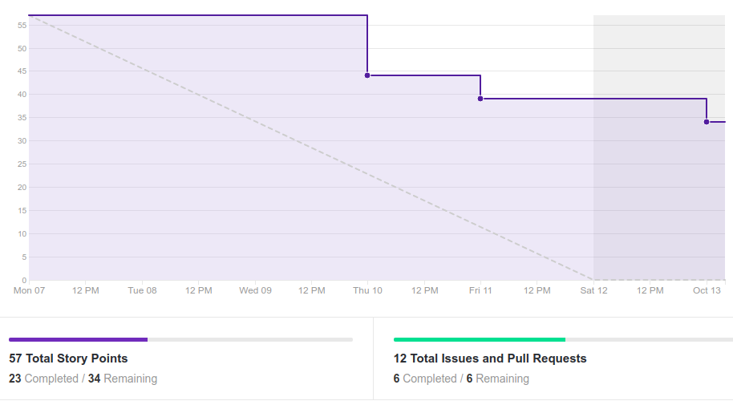
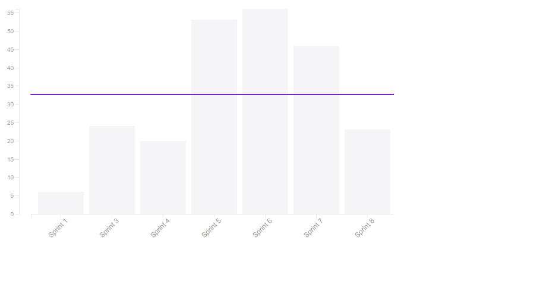
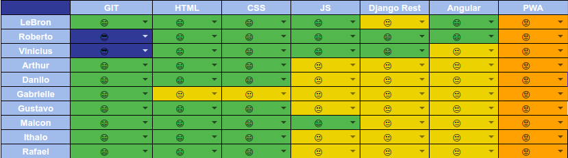
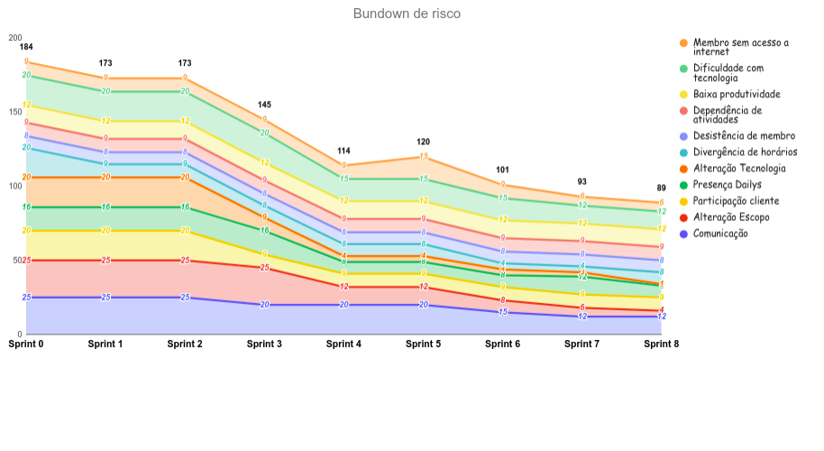

# Resultado da Sprint 8

 # 1. Revisão

| História | É Dívida Técnica? |
| -------- | :----: |
| US01 - Cadastrar Usuário(Frontend) | :white_check_mark: |
| US01 - Cadastrar Usuário(Backend) | :white_check_mark: |
| US04 - Manter Grupo(Frontend) | :x: |
| US04 - Manter Grupo(Backend) | :x: |
| US10 - Realizar Formulários de felicidade autentica(Frontend) | :x: |
| US10 - Realizar Formulários de felicidade autentica(Backend) | :x: |
| US11 - Manter Agendas da Felicidade(Frontend) | :x: |
| US11 - Manter Agendas da Felicidade(Backend) | :x: |
| DOC35 - Preparação para entrega da 1ª Release | :white_check_mark: |
| DOC36 - Documentar resultado sprint 7 e planejamento sprint 8 | :x: |
| Criar Home Page | :x: |
| Adicionar identidade visual na aplicação | :white_check_mark: |

## 1.1 O que foi feito?
* US01 - Cadastrar Usuário(Backend)
* US11 - Manter Agendas da Felicidade(Backend)
* DOC34 - Documentar resultado sprint 7 e planejamento sprint 8
* Criar Home Page
* Adicionar identidade visual na aplicação

## 1.2. O não foi feito e por que não foi feito?
* US01 - Cadastrar Usuário(Frontend)
    * Falta estilizar e ajustar arrumar funcionalidades
* US04 - Manter Grupo(Frontend)
    * Faltam alguns detalhes
* US04 - Manter Grupo(Backend)
    * Faltam alguns ajustes e testes
* US10 - Realizar Formulários de felicidade autentica(Backend)
* US10 - Realizar Formulários de felicidade autentica(Frontend)
* US11 - Manter Agendas da Felicidade(Frontend)
    * Revisão do PR foi tardia e foram requisitados ajustes
    * Faltam os testes
* DOC35 - Preparação para entrega da 1ª Release

# 2. Retrospectiva

## 2.1. O que deu certo?  

* Pareamentos produtivos
* Mais resultados em menos tempo
* MDS's com mais iniciativa para começar
* Equipe mais entrosada
* Evolução com a tecnologia

## 2.2. O que deu errado? 

* Pareamento com muito integrantes
* Erros de dependência(Ambiente) -> Envolveu falta de comunicação tb
* Tempo gasto para resolver problemas -> É normal isso
* Dificuldade com tecnologia(Angular)
* Problemas com computador
* Membros ocupados com outras tarefas
* Incompatibilidade de horários no pareamento
* Membro viajando

## 2.3. Como melhorar?
* Pareamentos em dupla
* Criar uma espécie de FAQ para erros comuns
* Planejamento/Retrospectiva/Revisão no domingo

# 3. Burndown Chart

# 4. Velocity

# 5. Quadro de Conhecimento

# 6. Burndown de Risco

# 7. Relato do Scrum Master

    A partir dessa sprint as sprints começarão na segunda e terminarão no domingo, já que na maior parte das sprints o domingo era usado para matar as dívidas.

    Essa sprint foi bastante improdutiva, a maior parte do grupo de desenvolvedores estavam muito sobrecarregado com outras atividades, incluindo a equipe de EPS. Tendo em vista essa alta improdutividade, o Mateus Oliveira(PO) propôs que nós alterassemos o planejamento/revisão/retrospectiva das sprints para o domingo, para ter o sábado livre apenas para desenvolver, e toda a equipe concordou com isso.

    A equipe de desenvolvimento ainda está com muita dificuldade técnica e muita dependência da equipe de EPS, além disso alguns problemas em relação ao ambiente continuam gerando um overhead na hora de desenvolver. 

