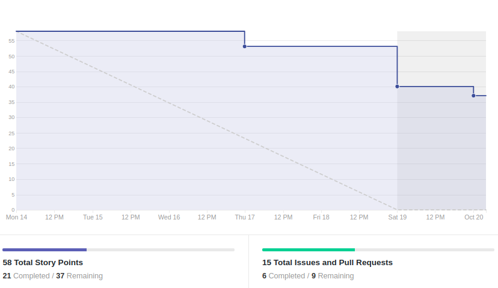
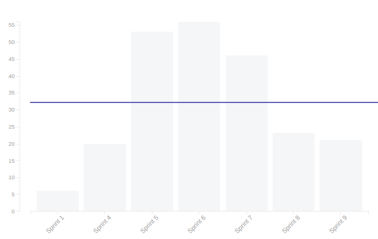
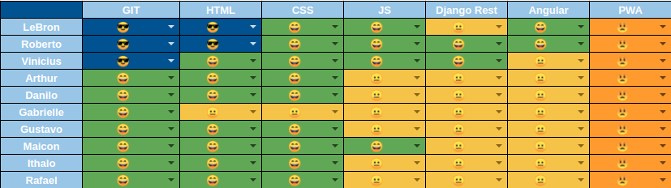
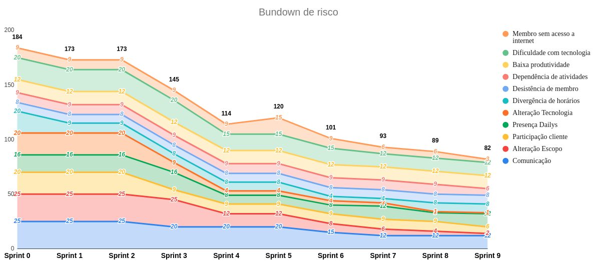

# Resultado da Sprint 9

 # 1. Revisão

| História | Foi concluída? |
| -------- | :----: |
| US01 - Cadastrar Usuário(Frontend) | :x: |
| US04 - Manter Grupo(Frontend) | :x: |
| US10 - Realizar Formulários de felicidade autentica(Frontend) | :x: |
| US10 - Realizar Formulários de felicidade autentica(Backend) | :x: |
| US11 - Manter Agendas da Felicidade(Frontend) | :white_check_mark: |
| US11 - Manter Agendas da Felicidade(Backend) | :white_check_mark: |
| DOC35 - Preparação para entrega da 1ª Release | :white_check_mark: |
| DOC37 - Documentar resultado sprint 9 e planejamento sprint 9 | :white_check_mark: |
| Integrar login do usuário com o sistema | :x: |

## 1.1 O que foi feito?
* US11 - Manter Agendas da Felicidade(Backend)
* US11 - Manter Agendas da Felicidade(Frontend)
* DOC35 - Preparação para entrega da 1ª Release
* DOC37 - Documentar resultado sprint 8 e planejamento sprint 9

## 1.2. O não foi feito e por que não foi feito?

* US04 - Manter Grupo(Frontend)
    * Faltam alguns ajustes
* US10 - Realizar Formulários de felicidade autentica(Backend)
    * Relacionamento many to many
* US10 - Realizar Formulários de felicidade autentica(Frontend)
    * Definição do frontend
* US01 - Cadastrar Usuário(Frontend)
    * Falta estilizar e ajustar arrumar funcionalidades
* Integrar login do usuário com o sistema
    * Por conta das refatorações que ocorreram no backend

# 2. Retrospectiva

## 2.1. O que deu certo?  

* Reunião no sábado apenas para desenvolvimento
* Suporte entre o grupo
* Autonomia do grupo
* Validação do trabalho com o cliente

## 2.2. O que deu errado? 

* Membros ausentes
* Dificuldade no pareamento
* Comunicação melhor entre membros da equipe
* Issue sobrecarregada
* Não dar prioridade para a matéria
* Dailys
* Comunicação pelo telegram não dá certo
* Atrasos frequentes
* Falta de comprometimento com prazo das issues

## 2.3. Como melhorar?

* Alterar o daily de quarta para mensagem
* Mesclar pareamentos em dívidas

# 3. Burndown Chart

# 4. Velocity

# 5. Quadro de Conhecimento

# 6. Burndown de Risco

# 7. Relato do Scrum Master

    

        Essa sprint foi muito abaixo do esperado, pois foi dedicada para finalizar as dívidas e nem isso foi feito. Alguns integrantes da equipe tiveram um compromisso na sexta, sábado e domingo, e isso contribuiu para o baixo rendimento nessa sprint. Mas o principal motivo do baixo rendimento é a dedicação da equipe no projeto, nem toda a equipe está tendo o projeto como prioridade.
    

    

        Outro ponto que atrapalha muito a evolução das atividades é a dificuldade em trabalhar em equipe, alguns integrantes da equipe não seguem a prática do pareamento. A questão da disponibilidade também atrapalha muito essa prática, pois o único dia que conseguimos parear presencialmente é no sábado, sendo que os pareamentos via hangouts não tem a mesma eficiência. 
    

    

        A equipe de desenvolvimento ainda está com muita dificuldade técnica e muita dependência da equipe de EPS, além disso alguns problemas em relação ao ambiente continuam gerando um overhead na hora de desenvolver. Esse é um problema que já existia na sprint passada e continua a existir nessa.
    

